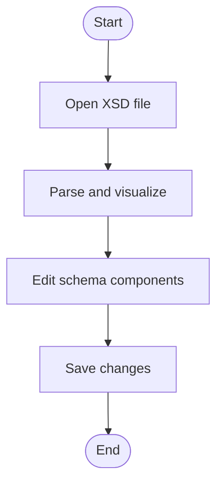

# Visual XML Schema Editor for VS Code

## Project Description

This project is a Visual Studio Code extension for visualizing and editing XML Schema files (XSD). The goal is to make working with complex XML schemas easier and more intuitive by providing a graphical interface.

## Features

- Parse and visualize XSD files
- Interactive editing of schema components (elements, types, attributes)
- Webview-based graphical UI

## Prerequisites

- **Node.js** (v16 or newer recommended)
- **npm** (comes with Node.js)
- **Visual Studio Code** (v1.46 or newer)
- **Git** (for cloning the repository)

## Installation & Getting Started

1. Clone the repository:
   ```sh
   git clone https://github.com/neumaennl/vscode-visual-xml-schema-editor.git
   cd vscode-visual-xml-schema-editor
   ```
2. Install dependencies:
   ```sh
   npm install
   ```
3. Start the extension in development mode:
   - Open the project in VS Code
   - Press `F5` to launch the Extension Development Host

## Common Issues & Troubleshooting

- **Extension does not open XSD files visually:**
  - Make sure you started VS Code with `F5` (Extension Development Host).
  - Try right-clicking the XSD file and select "Open With..." → "Visual XML Schema Editor".
  - Check that your `package.json` has the correct `contributes.customEditors` and `activationEvents` for `.xsd` files.
- **Dependencies not installing:**
  - Ensure you are using a compatible Node.js version (v16+).
  - Delete `node_modules` and run `npm install` again.
- **Webview is blank or not rendering:**
  - Check the VS Code "Developer Tools" console for errors (`Help > Toggle Developer Tools`).
  - Make sure all required files are built (run `npm run compile` if needed).
- **Other errors:**
  - Check the output in the "Extension Host" window for error messages.
  - Make sure you have the latest VS Code version.

## Example Use Case

A user wants to edit an XML schema for weather data. They open the XSD file in VS Code, see a visual representation, and can directly modify elements, types, and attributes.

## Activity Diagram: Edit Schema



## Folder Structure

exampleFiles/ # Example XSD files
src/ # Extension source code
model/ # Data models for XSD components
parser/ # XSD parser
webview/ # Webview UI
util.ts # Utility functions
extension.ts # Extension entry point
LICENSE
package.json
webpack.webview.config.js
eslint.config.js

---

**With this extension, developers and domain experts can efficiently and intuitively edit XML schemas directly in VS Code.**
