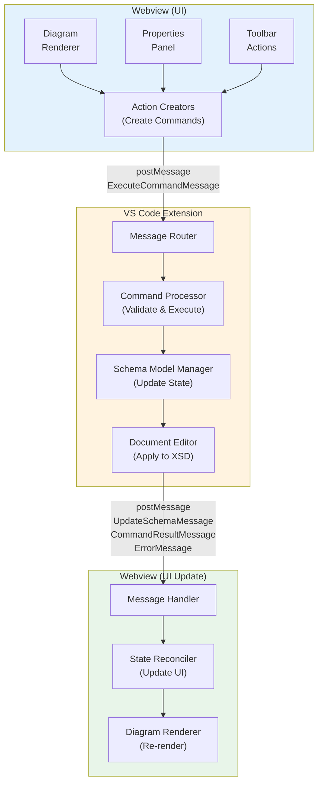

# Message Protocol Documentation

This document defines the message protocol for communication between the VS Code extension and the webview in the Visual XML Schema Editor.

## Overview

The editor uses a **bidirectional message-passing protocol** to enable editing operations and state synchronization between the extension (backend) and webview (frontend). The protocol is based on VS Code's message passing API with strongly-typed messages.

### Key Principles

1. **Type Safety**: All messages use TypeScript discriminated unions for compile-time type checking
2. **Command Pattern**: Editing operations are encapsulated as command objects
3. **Unidirectional Data Flow**: Extension holds authoritative schema state; webview holds derived UI state
4. **Error Handling**: Standardized error reporting with actionable feedback
5. **Extensibility**: New message types can be added without breaking existing code

## Architecture



## Message Types

### Webview to Extension Messages

Messages sent from the webview to the extension to request actions or changes.

#### ExecuteCommandMessage

Requests execution of a schema editing command.

**Interface:**
```typescript
interface ExecuteCommandMessage {
  command: "executeCommand";
  data: SchemaCommand;
}
```

**Example:**
```typescript
// Add a new element
const message: ExecuteCommandMessage = {
  command: "executeCommand",
  data: {
    type: "addElement",
    payload: {
      parentId: "/element:person",
      elementName: "address",
      elementType: "AddressType",
      minOccurs: 0,
      maxOccurs: "unbounded"
    }
  }
};

vscode.postMessage(message);
```

**Flow:**
1. User interacts with UI (e.g., clicks "Add Element" button)
2. Webview creates command object with appropriate payload
3. Webview posts ExecuteCommandMessage to extension
4. Extension validates and executes command
5. Extension updates schema and document
6. Extension sends UpdateSchemaMessage or ErrorMessage back to webview

### Extension to Webview Messages

Messages sent from the extension to the webview to update state or report results.

#### UpdateSchemaMessage

Sends the complete schema to the webview for rendering.

**Interface:**
```typescript
interface UpdateSchemaMessage {
  command: "updateSchema";
  data: schema;
}
```

**When sent:**
- Initial load of the editor
- After successful command execution
- After external document changes (e.g., manual XML edits)

**Example:**
```typescript
webview.postMessage({
  command: "updateSchema",
  data: schemaObject
});
```

**Webview handling:**
```typescript
window.addEventListener("message", (event) => {
  const message = event.data;
  if (message.command === "updateSchema") {
    // Re-build and re-render diagram
    const diagram = buildDiagramFromSchema(message.data);
    renderDiagram(diagram);
  }
});
```

#### CommandResultMessage

Reports the result of command execution.

**Interface:**
```typescript
interface CommandResultMessage {
  command: "commandResult";
  data: CommandResponse;
}

interface CommandResponse {
  success: boolean;
  error?: string;
  data?: unknown;
}
```

**Examples:**

Success case:
```typescript
{
  command: "commandResult",
  data: {
    success: true,
    data: {
      elementId: "/element:person/element:address[0]"
    }
  }
}
```

Failure case:
```typescript
{
  command: "commandResult",
  data: {
    success: false,
    error: "Parent element not found: /element:nonexistent"
  }
}
```

**Webview handling:**
```typescript
window.addEventListener("message", (event) => {
  const message = event.data;
  if (message.command === "commandResult") {
    if (message.data.success) {
      showNotification("Operation completed successfully");
    } else {
      showError(message.data.error);
    }
  }
});
```

#### ErrorMessage

Reports errors that occur during processing.

**Interface:**
```typescript
interface ErrorMessage {
  command: "error";
  data: ErrorData;
}

interface ErrorData {
  message: string;
  code?: string;
  stack?: string;
}
```

**Example:**
```typescript
{
  command: "error",
  data: {
    message: "Failed to parse schema: Invalid XML syntax at line 42",
    code: "PARSE_ERROR",
    stack: "Error: Invalid XML syntax\n  at parseSchema (...)"
  }
}
```

**Webview handling:**
```typescript
window.addEventListener("message", (event) => {
  const message = event.data;
  if (message.command === "error") {
    displayErrorDialog(message.data.message);
    console.error(`Error [${message.data.code}]:`, message.data.message);
  }
});
```

#### UpdateDiagramOptionsMessage

Updates display options for the diagram.

**Interface:**
```typescript
interface UpdateDiagramOptionsMessage {
  command: "updateDiagramOptions";
  data: DiagramOptions;
}

interface DiagramOptions {
  showDocumentation: boolean;
  alwaysShowOccurrence: boolean;
  showType: boolean;
}
```

**When sent:**
- When user changes settings in VS Code preferences
- On initial editor load

**Example:**
```typescript
{
  command: "updateDiagramOptions",
  data: {
    showDocumentation: true,
    alwaysShowOccurrence: false,
    showType: true
  }
}
```

#### SchemaModifiedMessage

Notifies webview that the schema has been modified (alternative to UpdateSchemaMessage with just the changed data).

**Interface:**
```typescript
interface SchemaModifiedMessage {
  command: "schemaModified";
  data: schema;
}
```

**Note:** Currently, this is similar to UpdateSchemaMessage. In future optimizations, this could carry only the delta/changes rather than the full schema.

## Command Protocol

### Command Structure

All commands follow the same structure defined by the Command Pattern:

```typescript
interface BaseCommand<T = unknown> {
  type: string;        // Command type discriminator
  payload: T;          // Command-specific data
}
```

Commands are strongly typed using discriminated unions:

```typescript
type SchemaCommand =
  | AddElementCommand
  | RemoveElementCommand
  | ModifyElementCommand
  | AddAttributeCommand
  | RemoveAttributeCommand
  | ModifyAttributeCommand
  | AddSimpleTypeCommand
  | RemoveSimpleTypeCommand
  | ModifySimpleTypeCommand
  | AddComplexTypeCommand
  | RemoveComplexTypeCommand
  | ModifyComplexTypeCommand
  | AddGroupCommand
  | RemoveGroupCommand
  | ModifyGroupCommand
  | AddAttributeGroupCommand
  | RemoveAttributeGroupCommand
  | ModifyAttributeGroupCommand
  | AddAnnotationCommand
  | RemoveAnnotationCommand
  | ModifyAnnotationCommand
  | AddDocumentationCommand
  | RemoveDocumentationCommand
  | ModifyDocumentationCommand
  | AddImportCommand
  | RemoveImportCommand
  | ModifyImportCommand
  | AddIncludeCommand
  | RemoveIncludeCommand
  | ModifyIncludeCommand;
```

### Command Categories

See [COMMAND_TYPES.md](../shared/COMMAND_TYPES.md) for detailed documentation on all available commands and their payloads.

## ID Strategy

The protocol uses a **stable, XPath-like identifier system** for referencing schema nodes. This ensures consistent identification across webview and extension boundaries.

### ID Format

IDs follow an XPath-like path structure:

**Pattern:** `/<nodeType>:<name>[<position>]`

**Examples:**
- Top-level element: `/element:person`
- Child element: `/element:person/element:address[0]`
- Complex type: `/complexType:PersonType`
- Anonymous type: `/element:person/anonymousComplexType[0]`
- With namespace: `/element:{http://example.com/ns}person`

### ID Components

1. **Node Type**: Schema construct type (element, complexType, simpleType, etc.)
2. **Name**: The name attribute of the schema node (if present)
3. **Position**: Zero-based index among siblings (for disambiguation)
4. **Namespace**: Optional namespace URI (in `{uri}name` format)

### ID Generation

IDs are generated by the **DiagramBuilder** in the webview when creating DiagramItems. The `shared/idStrategy` module provides utilities that both the webview and extension can use to work with IDs.

**In DiagramBuilder (webview-src/diagram/DiagramBuilder.ts):**
```typescript
import { generateSchemaId, SchemaNodeType } from "../../shared/idStrategy";

// Generate ID when creating DiagramItem
const item = new DiagramItem(
  generateSchemaId({
    nodeType: SchemaNodeType.Element,
    name: elementName
  }),
  elementName,
  DiagramItemType.element,
  this.diagram
);

// For child elements
const childItem = new DiagramItem(
  generateSchemaId({
    nodeType: SchemaNodeType.Element,
    name: childName,
    parentId: parent.id,
    position: 0
  }),
  childName,
  DiagramItemType.element,
  this.diagram
);
```

The webview uses these IDs in command payloads, and the extension uses ID parsing utilities to locate the corresponding schema nodes.

### ID Parsing

IDs can be parsed to extract components:

```typescript
import { parseSchemaId } from "./shared/idStrategy";

const parsed = parseSchemaId("/element:person/element:address[0]");
// {
//   nodeType: SchemaNodeType.Element,
//   name: "address",
//   position: 0,
//   parentId: "/element:person",
//   path: ["element:person", "element:address[0]"]
// }
```

### Cross-Boundary Mapping

The ID strategy enables bidirectional mapping:

**Webview (DiagramBuilder):**
1. Parses schema object received from extension
2. Generates stable IDs using `generateSchemaId()` when creating DiagramItems
3. Each DiagramItem has an `id` property with the generated ID
4. DiagramItems are displayed in the diagram with their IDs

**Webview (Commands):**
1. User selects node in diagram (gets DiagramItem with ID)
2. User action triggers command creation
3. Command includes node ID from DiagramItem (e.g., `parentId`, `elementId`)
4. Webview sends command with ID to extension

**Extension (Command Execution):**
1. Receives command with ID reference
2. Uses ID parsing utilities (`parseSchemaId()`, etc.) to understand the ID
3. Locates corresponding node in schema object using ID information
4. Applies changes to the schema
5. Sends updated schema back to webview

**Webview (Update):**
1. Receives updated schema from extension
2. DiagramBuilder regenerates IDs consistently
3. IDs remain stable if schema structure unchanged
4. Diagram updates preserve user selection and state

### Handling ID-less Elements

Some schema elements may not have explicit `name` attributes (e.g., anonymous types, choice/sequence groups). These are handled using:

1. **Position-based IDs**: Use zero-based index among siblings
2. **Type identifiers**: Use node type + position (e.g., `/anonymousComplexType[0]`)

**Example:**
```xml
<xs:element name="person">
  <xs:complexType>  <!-- Anonymous type -->
    <xs:sequence>   <!-- No name -->
      <xs:element name="firstName" type="xs:string"/>
    </xs:sequence>
  </xs:complexType>
</xs:element>
```

Generated IDs:
- Element "person": `/element:person`
- Anonymous complexType: `/element:person/anonymousComplexType[0]`
- First child element: `/element:person/anonymousComplexType[0]/element:firstName[0]`

## Message Flow Examples

### Example 1: Adding an Element

**Step 1:** User clicks "Add Element" button in webview

**Step 2:** Webview sends command
```typescript
vscode.postMessage({
  command: "executeCommand",
  data: {
    type: "addElement",
    payload: {
      parentId: "/element:person",
      elementName: "email",
      elementType: "string",
      minOccurs: 0,
      maxOccurs: "unbounded"
    }
  }
});
```

**Step 3:** Extension validates command
- Checks if parent exists
- Validates element name is unique within parent
- Validates type reference

**Step 4:** Extension executes command
- Locates parent node using ID
- Creates new element in schema model
- Generates ID for new element: `/element:person/element:email[0]`
- Marshals schema to XML
- Applies edit to VS Code document

**Step 5:** Extension sends result
```typescript
webview.postMessage({
  command: "commandResult",
  data: {
    success: true,
    data: {
      elementId: "/element:person/element:email[0]"
    }
  }
});
```

**Step 6:** Extension sends updated schema
```typescript
webview.postMessage({
  command: "updateSchema",
  data: updatedSchemaObject
});
```

**Step 7:** Webview updates UI
- Parses updated schema
- Rebuilds diagram
- Highlights newly added element
- Preserves user's scroll position and selection

### Example 2: Modifying Element Properties

**Step 1:** User edits element properties in properties panel

**Step 2:** Webview sends command
```typescript
vscode.postMessage({
  command: "executeCommand",
  data: {
    type: "modifyElement",
    payload: {
      elementId: "/element:person/element:address[0]",
      maxOccurs: "unbounded",
      documentation: "Person's address (can have multiple)"
    }
  }
});
```

**Step 3:** Extension processes command
- Locates element by ID
- Validates changes
- Updates schema model
- Applies to document

**Step 4:** Extension confirms success
```typescript
webview.postMessage({
  command: "commandResult",
  data: { success: true }
});

webview.postMessage({
  command: "updateSchema",
  data: updatedSchemaObject
});
```

### Example 3: Error Handling

**Step 1:** User tries to add element with invalid parent ID

**Step 2:** Webview sends command
```typescript
vscode.postMessage({
  command: "executeCommand",
  data: {
    type: "addElement",
    payload: {
      parentId: "/element:nonexistent",
      elementName: "test",
      elementType: "string"
    }
  }
});
```

**Step 3:** Extension validation fails

**Step 4:** Extension sends error
```typescript
webview.postMessage({
  command: "commandResult",
  data: {
    success: false,
    error: "Parent element not found: /element:nonexistent"
  }
});
```

**Step 5:** Webview displays error
- Shows error notification
- Highlights problematic field in UI
- Suggests corrective action

## Error Handling Patterns

### Validation Errors

**Extension-side validation:**
- Check command structure
- Validate ID references
- Verify schema constraints
- Check type references

**Response:**
```typescript
{
  command: "commandResult",
  data: {
    success: false,
    error: "Validation failed: Element name must not be empty"
  }
}
```

### Runtime Errors

**Unexpected errors during execution:**

```typescript
{
  command: "error",
  data: {
    message: "Failed to marshal schema to XML",
    code: "MARSHAL_ERROR",
    stack: "Error: Invalid schema structure\n  at marshal (...)"
  }
}
```

### Webview-side validation

The webview should perform basic validation before sending commands:
- Check required fields are present
- Validate input formats (e.g., valid XML names)
- Check ID references exist in current diagram

This provides immediate feedback and reduces unnecessary round-trips.

## State Synchronization

### Single Source of Truth

The extension maintains the authoritative schema state:
- Schema model in memory (unmarshaled from XML)
- VS Code document contains the serialized XML
- Webview receives a snapshot of the schema for rendering

### Update Strategies

**Full Update (Current):**
- Extension sends complete schema after each change
- Webview rebuilds entire diagram
- Simple but potentially inefficient for large schemas

**Incremental Update (Future):**
- Extension sends only changed portions
- Webview applies minimal updates to diagram
- Better performance for large schemas

### Handling External Changes

When the document is modified outside the editor (e.g., direct XML edits):

1. VS Code fires `onDidChangeTextDocument` event
2. Extension re-parses schema
3. Extension sends `UpdateSchemaMessage` to webview
4. Webview rebuilds diagram

**Challenge:** Preserving user state (selection, scroll, zoom) across updates.

**Solution:** Webview stores state before update and restores after:
```typescript
// Before update
const state = {
  selectedNodeId: currentSelection?.id,
  scrollPosition: viewport.scrollTop,
  zoom: viewport.zoomLevel
};

// After update
diagram.selectNode(state.selectedNodeId);
viewport.scrollTo(state.scrollPosition);
viewport.setZoom(state.zoom);
```

## Performance Considerations

### Message Size

- Keep message payloads small
- Avoid sending large schema objects frequently
- Use compression for large schemas (future optimization)

### Batching

For operations that generate multiple changes:
- Batch multiple commands into a single transaction
- Send one update message after all changes complete
- Reduces UI flickering and improves performance

### Throttling

For frequent operations (e.g., property editing):
- Debounce user input before sending commands
- Accumulate changes and send periodically
- Balance responsiveness with message overhead

## Testing

### Unit Tests

Test individual message types and command structures:

```typescript
describe("ExecuteCommandMessage", () => {
  test("should have correct structure", () => {
    const message: ExecuteCommandMessage = {
      command: "executeCommand",
      data: {
        type: "addElement",
        payload: { parentId: "/element:person", elementName: "test", elementType: "string" }
      }
    };
    expect(message.command).toBe("executeCommand");
  });
});
```

### Integration Tests

Test end-to-end message flows:

```typescript
describe("Command execution flow", () => {
  test("should add element and send update", async () => {
    // Setup extension and webview
    const extension = new Extension();
    const webview = new MockWebview();

    // Send command
    extension.handleMessage({
      command: "executeCommand",
      data: { type: "addElement", payload: { ... } }
    });

    // Verify response
    expect(webview.receivedMessages).toContainEqual({
      command: "commandResult",
      data: { success: true }
    });
    expect(webview.receivedMessages).toContainEqual({
      command: "updateSchema",
      data: expect.any(Object)
    });
  });
});
```

### Message Protocol Tests

Test message serialization and type safety:

```typescript
describe("Message type safety", () => {
  test("should enforce discriminated union types", () => {
    const message: WebviewMessage = {
      command: "executeCommand",
      data: { type: "addElement", payload: { ... } }
    };
    // Type checking ensures only valid commands are accepted
  });
});
```

## Future Enhancements

### Optimistic Updates

Allow webview to update UI immediately before receiving confirmation:
1. Webview applies change optimistically
2. Sends command to extension
3. If command fails, reverts UI change
4. If command succeeds, keeps UI change

**Benefits:** More responsive UI
**Challenges:** Handling rollback, race conditions

### Streaming Updates

For very large schemas, stream changes instead of sending complete schema:
1. Extension sends initial schema snapshot
2. Subsequent changes sent as deltas
3. Webview applies patches incrementally

**Benefits:** Better performance with large schemas
**Challenges:** State synchronization complexity

### Offline Mode

Cache schema state in webview for offline editing:
1. Webview maintains local schema copy
2. Queue commands while offline
3. Sync when connection restored

**Benefits:** Better resilience to network issues
**Challenges:** Conflict resolution, data consistency

## References

- [COMMAND_TYPES.md](../shared/COMMAND_TYPES.md) - Detailed command documentation
- [ADR 001: Editor Transition Architecture](./architecture/001-editor-transition.md) - Architectural decisions
- [VS Code Webview API](https://code.visualstudio.com/api/extension-guides/webview) - VS Code documentation
- [Command Pattern](https://refactoring.guru/design-patterns/command) - Design pattern reference
