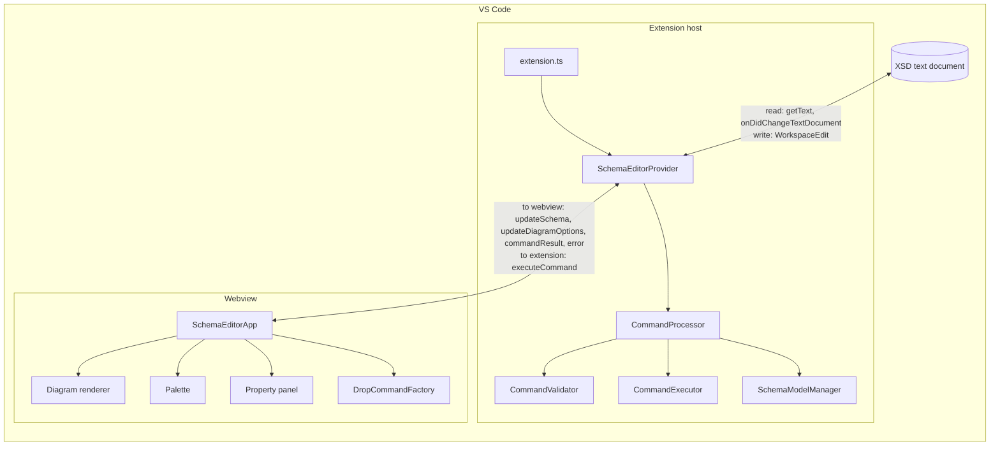

# Purpose

The extension adds a visual editor for XML Schema (`*.xsd`) files to VS Code. It shows a schema as an interactive diagram, and lets users add constructs from a palette by drag and drop and edit their properties in a side panel. Every change is written back to the XSD text, so the file stays a normal, version-controllable XSD.

The visual editor is offered as an alternative editor (priority `option`) next to the normal text editor. It opens through "Open With…", the explorer context menu or the command `xmlSchemaVisualEditor.openEditor`.[^manifest]

This documentation describes the editor as it is developed on the branch `copilot/add-editor-capabilities`. The version on `main` is still a viewer: it shows the diagram and the properties of the selected node, but has no palette and no editable property panel.

# Components

The code is split into three parts that run in two separate environments:

| Part | Folder | Runs in | Responsibility |
|---|---|---|---|
| Extension host | `src/` | VS Code extension host (Node.js) | Registers the custom editor, parses and serializes XSD, validates and executes edit commands, writes changes to the document. |
| Webview | `webview-src/` | Sandboxed webview (browser) | Renders the diagram, palette and property panel; turns user interactions into commands. |
| Shared | `shared/` | Both (compiled into each side) | Schema model classes generated from the XSD meta-schema, command and message types, the ID strategy and small schema utilities. |



The `shared/` code is imported by both sides and compiled into each separately. The extension host uses the generated schema classes at runtime together with `@neumaennl/xmlbind-ts` to convert between XML and objects. The webview uses them only as TypeScript types. It receives the schema as plain data through `postMessage` and does not include `xmlbind-ts`.[^shared-types][^webview-main]

# Runtime flow

1. **Open.** VS Code calls `SchemaEditorProvider.resolveCustomTextEditor`. The provider sets up the webview HTML, parses the document text into a schema object and sends it to the webview (`updateSchema`), together with the diagram settings (`updateDiagramOptions`).[^webview-provider]
2. **Render.** The webview builds a diagram model from the schema object, lays it out and renders it as SVG. See [Diagram rendering](diagram-rendering.md).
3. **Edit.** A user action (drop from the palette, change in the property panel) becomes a command. The webview sends it as an `executeCommand` message. See [Messaging](messaging.md).
4. **Execute.** The provider passes the command and the current document text to the `CommandProcessor`, which orchestrates the steps: `SchemaModelManager` parses the XML into a schema object, `CommandValidator` validates the command, `CommandExecutor` executes it on a copy of the schema, and `SchemaModelManager` serializes the result and parses it again as a check.[^command-processor] See [Persistence](persistence.md).
5. **Write back.** On success, the provider replaces the whole document text with the new XML in one `WorkspaceEdit` and reports `commandResult`.
6. **Refresh.** The document change fires `onDidChangeTextDocument`, and the provider parses the document again and sends a fresh `updateSchema`. The same path handles changes made in the text editor or by other tools.

# Principles

- **The XSD document is the single source of truth.** The webview never holds authoritative state. It re-renders from each `updateSchema`. The state it saves with `setState` is only a cache so the view survives being hidden and restored.
- **All changes are commands.** The webview never edits the schema directly. It sends typed commands, and the extension host validates and executes them.
- **Checks complement each other.** The webview checks what it can decide from the diagram, to give immediate feedback: drop targets, and empty or unchanged input. The extension host is the gatekeeper: it checks every command completely, including the rules that need the whole schema (names, types, references, duplicates), and decides. Rules are not copied to the webview for their own sake; where both sides check the same thing, such as where an element or attribute may be placed, it is because the webview needs it for feedback and the extension host must not rely on the webview (see [Messaging](messaging.md#validation-in-the-webview)).
- **Transactional execution.** Commands run on a copy of the schema, so a failed command leaves the document unchanged. The result is written as a single edit, which VS Code's undo handles as one step.
- **One set of shared types.** Commands, messages and the schema model are defined once in `shared/` and used by both sides, so the compiler checks both ends of the protocol.
- **Path-based IDs.** Schema nodes are identified by XPath-like IDs such as `/element:person/anonymousComplexType[0]`, which both sides can generate and resolve. See [Schema model](schema-model.md).
- **Native VS Code look.** The webview uses VS Code theme CSS variables and Codicons.

# Runtime dependencies

| Package | Used by | Purpose |
|---|---|---|
| `@neumaennl/xmlbind-ts` | Extension host | `unmarshal` (XML → objects) and `marshal` (objects → XML) for the generated schema classes; the `xsd2ts` generator used to create them. |
| `@vscode/codicons` | Webview | Icon font, loaded from `node_modules` through `webview.asWebviewUri`. |

The build outputs are `out/` (extension host and shared code, compiled by `tsc`) and `webview/` (the webpack bundle `main.js` plus `styles.css`).[^webpack] See [Build and packaging](build-and-packaging.md).

# Source layout

```text
src/                      Extension host
  extension.ts            Activation: registers the custom editor and command
  webviewProvider.ts      Custom editor provider, message handling, document edits
  commandProcessor.ts     Orchestrates parse → validate → execute → serialize
  commandValidator.ts     Dispatch to commandValidators/
  commandExecutor.ts      Dispatch to commandExecutors/
  schemaModelManager.ts   Holds the schema object; marshal/unmarshal/clone
  schemaNavigator.ts      Resolves IDs to nodes in the schema object
  commandValidators/      Validation rules per schema construct
  commandExecutors/       Execution per schema construct, rename and QName helpers
webview-src/              Webview
  main.ts                 SchemaEditorApp: startup, messages, state, selection, zoom/pan
  renderer.ts             Canvas, click and drag-and-drop handling
  diagram/                Schema → diagram model → layout → SVG
  palette/                Palette of schema constructs
  drop/                   Turns drops into commands
  propertyPanel/          Property panel tabs and editors
  styles.css              Layout and theming
shared/                   Used by both sides
  generated/              Classes generated from schema/XMLSchema.xsd (do not edit)
  commands/               Command type definitions
  messages.ts             Message type definitions
  idStrategy.ts           Generating and parsing node IDs
  schemaUtils.ts          Small helpers (toArray, schema root detection, prefixes)
  types.ts                Re-exports of all of the above
schema/XMLSchema.xsd      The XSD meta-schema the model classes are generated from
exampleFiles/             Sample XSD files for manual testing
```

# Design decisions

**Context.** The extension started as a read-only schema viewer. To turn it into an editor, ADR 001 chose a command-based design: the webview describes each change as a typed command, and the extension host validates it, executes it and writes the result to the document.[^adr-001] ADR 001 stays in the repository as long as its roadmap issues ([#18](https://github.com/neumaennl/vscode-visual-xml-schema-editor/issues/18) to [#21](https://github.com/neumaennl/vscode-visual-xml-schema-editor/issues/21)) are open. It names no alternatives that were considered.

**Why commands.** The ADR gives five reasons. All of them hold for the current code:

- Separation of concerns: the webview turns user actions into commands, the extension host owns validation, execution and the document (see [Principles](#principles)).
- Testability: validators and executors are tested per command without a webview (see [Persistence](persistence.md#command-pipeline)).
- Extensibility: a new editing operation is a new command type with its own validator and executor (see [Commands](commands.md)).
- Integration with VS Code: every command ends in one `WorkspaceEdit`, so undo, redo, the dirty marker and saving work as for any text edit (see [Persistence](persistence.md#undo-redo-and-save)).
- Single source of truth: the document; the webview only holds derived state.

**Where commands are created.** Each surface builds the commands for its own input: `DropCommandFactory` for drops from the palette,[^drop-factory] the property panel for edits.[^property-panel-commands] This follows the UX concept: adding starts in the palette, editing starts in the property panel, and the toolbar has no editing actions (see [UX concept](ux-concept.md#core-rules)).

**Diagram updates.** Every `updateSchema` rebuilds the whole diagram; only the expand state is carried over by node ID (see [Diagram rendering](diagram-rendering.md#pipeline) and [Known issues](known-issues.md#diagram-is-rebuilt-in-full-on-every-change)). Incremental updates are planned ([#19](https://github.com/neumaennl/vscode-visual-xml-schema-editor/issues/19)); they need unambiguous node IDs first ([#348](https://github.com/neumaennl/vscode-visual-xml-schema-editor/issues/348)).

**Undo and history.** Commands have no inverse and are not stored. Every command is applied as one `WorkspaceEdit`, so undo and redo are VS Code's text undo, which covers edits made in the text editor in the same way. The document text is the state; there is no command history.

[ADR 001](architecture/001-editor-transition.md#9-deviations-from-this-design) records where the implementation deviates from its design and why.

**Risks.** The ADR names four risks. Their mitigation today:

| Risk | Mitigation in the code | Open |
|---|---|---|
| XML marshalling | `xmlbind-ts` marshals the schema; the result is parsed again before it is written (see [Persistence](persistence.md#command-pipeline)). | No fallback to text edits. Serialization reformats the document and replaces the default namespace (see [Persistence](persistence.md#what-serialization-changes), [Known issues](known-issues.md#every-command-reformats-the-whole-document) and [Known issues](known-issues.md#default-namespace-is-replaced-on-serialization)). |
| Performance with large schemas | Children of collapsed nodes are neither laid out nor drawn. | No incremental update, no virtual scrolling, no performance tests (see [Known issues](known-issues.md#diagram-is-rebuilt-in-full-on-every-change)). |
| Undo and redo | Every command is one `WorkspaceEdit`, undone as one step. | None. |
| State synchronization | The document is the single source of truth; the webview re-renders from every `updateSchema`. | Commands can overlap while an edit is applied, and the view state is not fully restored (see [Known issues](known-issues.md#commands-can-overlap-while-an-edit-is-applied) and [Known issues](known-issues.md#view-state-is-not-restored-after-reopening)). |

[^manifest]: Extension manifest

[^shared-types]: Shared type exports

[^webview-main]: Webview entry point

[^webview-provider]: Custom editor provider

[^command-processor]: Command processor

[^webpack]: Webview bundle configuration

[^drop-factory]: DropCommandFactory

[^property-panel-commands]: Property panel command helpers

[^adr-001]: ADR 001: Editor Transition Architecture (design rationale and deviations)
