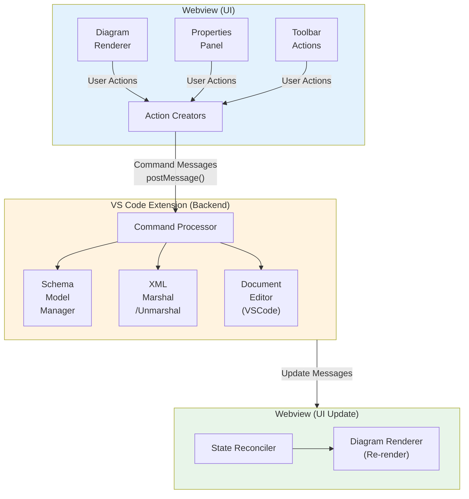
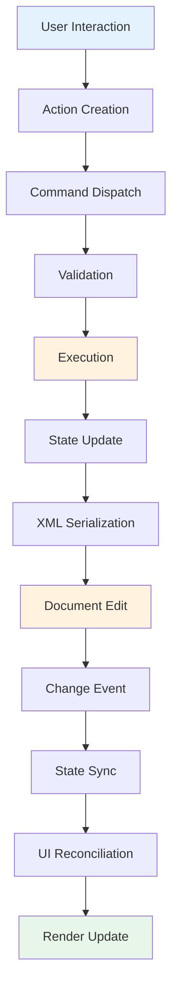

# ADR 001: Editor Transition Architecture

**Status:** Accepted  
**Date:** 2026-02-20  
**Authors:** Project Team  
**Type:** Architecture Decision Record

## 1. Overview (Goal)

### Current State

The Visual XML Schema Editor currently operates as a **viewer** with limited editing capabilities. The architecture follows a one-way data flow pattern where:

- The VS Code extension parses XSD files and sends schema objects to the webview
- The webview renders the schema diagram but has minimal interaction capabilities
- Document changes trigger re-parsing and full diagram updates
- The `applySchemaChanges` method is stubbed but not implemented

> **Implementation Progress (as of 2026-02-20):**
> Phase 1 (Foundation) is complete — all command types, the CommandProcessor, CommandValidator, CommandExecutor, SchemaModelManager, and message protocol have been implemented with unit tests. Phase 2 (Basic Editing) is in progress — element add/remove handlers are implemented, modifyElement is in draft PR.

### Goal

Transform the viewer into a fully-functional **visual editor** that allows users to:

- Modify XML schema elements, attributes, and types directly through the diagram
- Add, remove, and edit schema components visually
- See changes reflected immediately in both the diagram and the underlying XSD file
- Maintain consistency between the visual representation and the XML document
- Support undo/redo operations through VS Code's native editing infrastructure

### Success Criteria

- Users can perform common schema editing operations (add/remove/modify elements) through the diagram
- Changes are persisted back to the XSD file correctly
- The editing experience is responsive and intuitive
- Integration with VS Code features (undo/redo, dirty state, save) works seamlessly
- The architecture supports incremental feature additions

## 2. Architectural Pattern (Command-Driven State Updates)

### Pattern Choice: Command Pattern with Event Sourcing Principles

The editor will use a **Command Pattern** architecture to manage state updates, providing:

- **Encapsulation**: Each editing operation is encapsulated as a command object
- **Reversibility**: Commands can be undone/redone by design
- **Auditability**: Command history provides a log of all editing operations
- **Consistency**: Centralized command execution ensures state coherence

### Key Components



### Why This Pattern?

1. **Separation of Concerns**: Clear boundaries between UI actions, business logic, and data persistence
2. **Testability**: Commands can be tested in isolation
3. **Extensibility**: New editing operations can be added as new command types
4. **Integration**: Works naturally with VS Code's document editing model
5. **State Management**: Single source of truth maintained in the extension with derived state in webview

## 3. Data Flow (Action → Command → Extension Processing → Update Cycle → Reconciliation)

### Detailed Flow



### Step-by-Step Process

#### 3.1 User Interaction & Action Creation (Webview)

```typescript
// User clicks "Add Element" button
button.addEventListener("click", () => {
  const command = {
    type: "addElement",
    payload: {
      parentId: selectedNode.id,
      elementName: "newElement",
      elementType: "string",
    },
  };
  vscode.postMessage({
    command: "executeCommand",
    data: command,
  });
});
```

#### 3.2 Command Dispatch & Validation (Extension)

```typescript
// Extension receives command
handleWebviewMessage(message) {
  const command = message.data;

  // Validate command
  if (!this.validator.isValid(command)) {
    this.sendError('Invalid command');
    return;
  }

  // Execute command
  this.commandProcessor.execute(command, this.schemaModel);
}
```

#### 3.3 Execution & State Update (Extension)

```typescript
// Command processor updates schema model
execute(command, schemaModel) {
  switch(command.type) {
    case 'addElement':
      const parent = schemaModel.findNode(command.payload.parentId);
      const newElement = schemaModel.createElement(command.payload);
      parent.addChild(newElement);
      break;
    // ... other commands
  }
}
```

#### 3.4 XML Serialization & Document Edit (Extension)

```typescript
// Marshal updated schema to XML
const xmlContent = marshal(schemaModel);

// Apply edit to VS Code document
const edit = new vscode.WorkspaceEdit();
edit.replace(
  document.uri,
  new vscode.Range(0, 0, document.lineCount, 0),
  xmlContent
);
await vscode.workspace.applyEdit(edit);
```

#### 3.5 Change Event & State Sync (Extension)

```typescript
// VS Code triggers document change event
vscode.workspace.onDidChangeTextDocument((e) => {
  if (e.document.uri === currentDocument.uri) {
    // Re-parse and send to webview
    const updatedSchema = unmarshal(schema, e.document.getText());
    webview.postMessage({
      command: "updateSchema",
      data: updatedSchema,
    });
  }
});
```

#### 3.6 UI Reconciliation & Render Update (Webview)

```typescript
// Webview receives updated schema
window.addEventListener("message", (event) => {
  if (event.data.command === "updateSchema") {
    // Smart reconciliation - only update what changed
    this.reconciler.updateDiagram(this.currentSchema, event.data.data);
    this.currentSchema = event.data.data;
  }
});
```

### Flow Characteristics

- **Unidirectional**: Data flows in one clear direction
- **Predictable**: Each step has well-defined inputs and outputs
- **Observable**: Each stage can be logged and monitored
- **Interruptible**: Validation can halt invalid operations early
- **Transactional**: Changes are atomic at the document level

## 4. Proposed Changes

This section outlines the high-level architectural changes required to transform the viewer into an editor. The focus is on component responsibilities and design principles rather than implementation details.

### 4.1 Shared Type System (shared/types.ts)

**Responsibility**: Define the contract between webview and extension for editing operations.

**Key Concepts**:

- **Command Types**: Establish a type-safe vocabulary of editing operations (add, remove, modify) for all schema constructs:
  - Core structures: elements, attributes
  - Type definitions: simpleTypes, complexTypes
  - Organizational: groups, attributeGroups
  - Metadata: annotations, documentation
  - Modularity: imports, includes
- **Message Protocol**: Define bidirectional communication patterns between webview and extension
- **Payload Structures**: Specify the data required for each command type with appropriate validation constraints
- **Response Types**: Standardize success/failure feedback with error information

**Design Principles**:

- Type safety through TypeScript interfaces and union types
- Extensibility for adding new command types
- Consistency across all schema modification operations
- Clear separation between command intent and execution logic

### 4.2 Extension-Side Architecture (src/)

**Responsibility**: Manage schema state, execute commands, and synchronize with VS Code's document model.

#### Command Processor

**Role**: Central dispatcher for all editing commands with validation and execution logic.

**Responsibilities**:

- Validate incoming commands against schema rules and constraints
- Route commands to appropriate handlers based on command type
- Maintain command execution order and transactionality
- Provide error handling and recovery mechanisms
- Support all schema modification types (elements, attributes, simpleTypes, complexTypes, groups, attributeGroups, annotations, documentation, imports, includes)

**Design Principles**:

- Single responsibility for each command handler
- Fail-fast validation before any state modification
- Atomic operations at the schema model level
- Comprehensive logging for debugging

#### Schema Model Manager

**Role**: Maintain authoritative schema state and orchestrate updates.

**Responsibilities**:

- Hold the current parsed schema model as single source of truth
- Coordinate between command execution and document synchronization
- Handle schema unmarshaling from XML and marshaling back to XML
- Manage schema references and imports
- Provide query interface for schema introspection

**Design Principles**:

- Encapsulate schema complexity behind clean API
- Ensure model consistency through controlled mutations
- Support efficient diff computation for incremental updates
- Maintain immutability where possible for predictable behavior

#### Webview Provider Integration

**Role**: Bridge between VS Code's editor infrastructure and custom editing logic.

**Responsibilities**:

- Manage webview lifecycle (creation, disposal, state persistence)
- Route messages between webview and command processor
- Apply edits to VS Code documents through WorkspaceEdit API
- Handle document change events and trigger re-synchronization
- Coordinate undo/redo through VS Code's native stack
- Manage dirty state and save operations

**Design Principles**:

- Leverage VS Code's document editing primitives
- Maintain separation between UI logic and business logic
- Ensure all edits are undoable through standard mechanisms
- Handle concurrent edits gracefully

### 4.3 Webview-Side Architecture (webview-src/)

**Responsibility**: Provide interactive UI and translate user actions into commands.

#### Action Creators

**Role**: Convert user interactions into typed command messages.

**Responsibilities**:

- Encapsulate command construction logic
- Validate user input before command creation
- Provide user-friendly API for UI components
- Handle command serialization for message passing
- Support all editing operations across schema constructs

**Design Principles**:

- Pure functions with no side effects
- Type-safe command construction
- Clear naming conventions matching command types
- Consistent error handling patterns

#### State Reconciler

**Role**: Efficiently update UI in response to schema changes.

**Responsibilities**:

- Compute minimal diff between old and new schema states
- Determine optimal re-render strategy (full vs. incremental)
- Coordinate with diagram renderer for visual updates
- Preserve user state (selection, scroll position, expanded nodes)
- Handle animation and transitions for smooth UX

**Design Principles**:

- Minimize re-renders for performance
- Predictable update semantics
- Preserve focus and selection across updates
- Support both fine-grained and coarse-grained updates

#### Main Application Orchestration

**Role**: Coordinate all webview components and manage application lifecycle.

**Responsibilities**:

- Initialize all subsystems (renderer, actions, reconciler)
- Set up message handling and routing
- Manage user interaction handlers (clicks, drags, keyboard)
- Coordinate between diagram, toolbar, and properties panel
- Provide user feedback (notifications, errors, loading states)
- Persist and restore webview state

**Design Principles**:

- Clear component boundaries
- Event-driven architecture
- Centralized error handling
- Responsive user feedback

## 5. Diagram Integration Strategy

### Current Diagram Renderer

The existing diagram renderer (ported from xsddiagram) handles:

- Parsing schema structure into diagram items
- Layout calculation (positioning elements)
- SVG rendering
- Expand/collapse functionality

### Integration Approach

#### 5.1 Make Diagram Interactive

```typescript
// Add editing capabilities to diagram items
class DiagramItem {
  // Existing properties...

  // New: Enable editing interactions
  enableEditing(): void {
    this.addContextMenu();
    this.addInlineEditing();
    this.addDragAndDrop();
  }

  private addContextMenu(): void {
    // Right-click menu for: Add Child, Delete, Edit Properties
  }

  private addInlineEditing(): void {
    // Double-click to edit element name
  }

  private addDragAndDrop(): void {
    // Drag to reorder or move elements
  }
}
```

#### 5.2 Visual Feedback for Editing

```typescript
// Provide visual feedback during editing
class DiagramRenderer {
  highlightEditableNode(nodeId: string): void {
    // Add highlight border to indicate editable state
  }

  showTemporaryNode(nodeConfig: any): void {
    // Preview of new node before creation
  }

  animateNodeChange(
    nodeId: string,
    changeType: "add" | "remove" | "modify"
  ): void {
    // Smooth transitions for changes
  }
}
```

#### 5.3 Toolbar Enhancement

```html
<!-- Add editing tools to toolbar -->
<div id="toolbar">
  <!-- Existing tools -->
  <button id="zoomIn">Zoom In</button>
  <button id="zoomOut">Zoom Out</button>
  <button id="fitView">Fit View</button>

  <!-- New editing tools -->
  <div class="toolbar-separator"></div>
  <button id="addElement" title="Add Element">➕ Element</button>
  <button id="addAttribute" title="Add Attribute">🏷️ Attribute</button>
  <button id="deleteSelected" title="Delete">🗑️ Delete</button>

  <!-- Selection info -->
  <div id="selection-info">
    <span id="selected-node-name"></span>
  </div>
</div>
```

#### 5.4 Properties Panel Enhancement

**Goal**: Transform the read-only properties panel into an editable interface for modifying schema elements.

**Approach**: Enhance existing property display components to support in-place editing rather than creating a separate editable area.

**Key Changes**:

- Make property values editable where appropriate (e.g., element names, types, occurrence constraints)
- Add appropriate input controls based on property type (text fields, dropdowns, number spinners)
- Implement inline validation with immediate user feedback
- Connect property changes to command actions for persistence
- Preserve read-only display for computed or non-editable properties
- Support keyboard navigation and accessibility standards

**Design Considerations**:

- Match VS Code's form styling and interaction patterns
- Provide clear visual distinction between editable and read-only properties
- Support validation at the UI level before sending commands
- Enable batch edits (e.g., editing multiple properties before applying changes)
- Handle error states gracefully with informative messages

### 5.5 Selection Model and Usage

**Purpose**: Manage user selection state to enable context-aware editing operations.

**Core Responsibilities**:

- Track currently selected diagram nodes (single or multiple selection)
- Emit selection change events for UI coordination
- Provide selection queries for editing commands
- Support keyboard-based selection changes
- Maintain selection across diagram updates when possible

**Integration Points**:

1. **Toolbar Actions**: Toolbar buttons (Add Element, Delete, etc.) operate on the current selection. Buttons are enabled/disabled based on selection state and valid operations.

2. **Properties Panel**: The properties panel displays details for the currently selected node. Selection changes trigger property panel updates.

3. **Context Menus**: Right-click menus show operations valid for the selected node's type. The selection determines available menu items.

4. **Keyboard Shortcuts**: Arrow keys navigate between nodes, updating selection. Hotkeys (Delete, Ctrl+C, Ctrl+V) operate on the selected nodes.

5. **Command Execution**: Commands include the selected node IDs in their payload. For example, "Add Element" adds a child to the selected parent node.

6. **Visual Feedback**: The diagram renderer highlights selected nodes with distinct styling (border, background, etc.) to provide clear visual feedback.

**Selection Patterns**:

- Click to select single node (replaces previous selection)
- Ctrl+Click to toggle node in multi-selection
- Click on canvas background to clear selection
- Arrow keys to navigate selection
- Shift+Arrow for extending selection (future enhancement)

**State Preservation**:

- Selection IDs are preserved across diagram re-renders when nodes still exist
- Selection is cleared for deleted nodes
- Selection is adjusted for nodes that have moved in the hierarchy

## 6. Implementation Roadmap

### Phase 1: Foundation

**Goal**: Establish command infrastructure and core abstractions.

#### Milestones:

- [x] Define command types in shared/types.ts for all schema constructs (elements, attributes, simpleTypes, complexTypes, groups, attributeGroups, annotations, documentation, imports, includes)
- [x] Implement CommandProcessor class with validation framework
- [x] Implement SchemaModelManager class with state management
- [x] Update message protocol for bidirectional communication
- [x] Add comprehensive command validation
- [x] Write unit tests for command execution
- [x] Establish error handling patterns

**Success Criteria**: Commands can be defined, validated, and executed in isolation with proper error handling.

### Phase 2: Basic Editing Operations

**Goal**: Implement core CRUD operations for all schema constructs.

#### Milestones:

- [x] Implement element commands (add, remove, modify)
- [ ] Implement attribute commands (add, remove, modify)
- [ ] Implement simpleType and complexType commands (add, remove, modify)
- [ ] Implement group and attributeGroup commands (add, remove, modify)
- [ ] Implement annotation and documentation commands (add, remove, modify)
- [ ] Implement import and include commands (add, remove, modify)
- [x] Connect commands to document edits via [WorkspaceEdit](https://code.visualstudio.com/api/references/vscode-api#WorkspaceEdit) (VS Code's API for programmatic text edits with undo/redo support)
- [ ] Implement rollback on validation failures
- [ ] Test with simple schema modifications
- [ ] Verify undo/redo functionality
- [ ] Write integration tests for all schema construct editing flows

**Success Criteria**: Can programmatically add, remove, and modify **all** schema constructs (elements, attributes, simpleTypes, complexTypes, groups, attributeGroups, annotations, documentation, imports, includes) with proper VS Code integration.

### Phase 3: UI Integration

**Goal**: Make diagram and properties panel interactive for user-driven editing.

#### Milestones:

- [ ] Implement SchemaActions in webview for command dispatch
- [ ] Add context menu to diagram items with relevant actions
- [ ] Implement toolbar editing buttons
- [ ] Make properties panel editable with inline validation
- [ ] Add visual feedback for operations (loading states, confirmations)
- [ ] Implement selection manager with multi-select support
- [ ] Add keyboard shortcuts for common operations

**Success Criteria**: Users can perform all basic editing operations through intuitive UI interactions.

### Phase 4: State Reconciliation and Performance

**Goal**: Optimize diagram updates for responsiveness with large schemas.

#### Milestones:

- [ ] Implement StateReconciler with diff computation
- [ ] Add incremental diagram updates (avoid full re-renders)
- [ ] Implement animation/transitions for changes
- [ ] Add lazy rendering for collapsed nodes
- [ ] Test with medium schemas (100-300 elements) and profile performance
- [ ] Optimize bottlenecks to achieve smooth operation
- [ ] Test with large schemas (500+ elements) and verify acceptable performance
- [ ] Implement virtual scrolling if needed for very large schemas

**Success Criteria**: Diagram updates are smooth, only re-render changed portions, and handle medium schemas (100-300 elements) with updates in under 100ms. Large schemas (500+ elements) should remain usable with acceptable response times (<500ms for updates).

### Phase 5: Advanced Editing Features

**Goal**: Add sophisticated editing capabilities for power users.

#### Milestones:

- [ ] Implement drag-and-drop reordering of elements
- [ ] Add copy/paste functionality with clipboard integration
- [ ] Implement inline editing (double-click to rename)
- [ ] Add find/replace functionality
- [ ] Implement batch operations (multi-delete, bulk property changes)
- [ ] Add validation feedback in UI with actionable messages

**Success Criteria**: Users can perform all editing operations defined in Phase 1-4 using advanced methods (drag-and-drop, copy/paste, keyboard shortcuts, batch operations). Operations that span multiple elements (find/replace, bulk edits) work reliably. UI provides real-time validation feedback.

### Phase 6: Polish and Hardening

**Goal**: Ensure production readiness with comprehensive testing and refinement.

#### Milestones:

- [ ] Comprehensive integration testing (see Testing Strategy below)
- [ ] Error handling and recovery for edge cases
- [ ] Performance testing with large, real-world schemas
- [ ] Accessibility improvements (ARIA labels, keyboard navigation)
- [ ] User documentation and guided tutorials
- [ ] Bug fixes and UI/UX refinements
- [ ] Security review and vulnerability assessment

**Success Criteria**: Editor is stable, performant, accessible, and ready for production use.

### Testing Strategy

Testing is critical to ensure the editor works reliably across diverse schemas and usage patterns. The strategy encompasses multiple testing levels:

#### Unit Tests

**Scope**: Individual components and functions in isolation.

**What to Test**:

- **Command Validation**: Each command type validates its payload correctly, rejecting invalid inputs
- **Command Execution**: Command processors correctly modify the schema model for all operation types (add, remove, modify)
- **XML Marshaling/Unmarshaling**: Round-trip conversion preserves schema semantics and structure
- **Diff Computation**: StateReconciler correctly identifies additions, removals, and modifications
- **Selection Manager**: Selection state transitions (select, deselect, multi-select) work correctly
- **Schema Model Queries**: Finding nodes, traversing hierarchy, checking constraints

**Tools**: [Jest](https://jestjs.io/) or [Mocha](https://mochajs.org/) with assertion libraries. Mock VS Code API where needed.

**Coverage Goal**: 80%+ code coverage for core business logic.

#### Integration Tests

**Scope**: Component interactions and end-to-end workflows.

**What to Test**:

- **Command Flow**: User action → command creation → validation → execution → document update → UI refresh
- **Document Synchronization**: Changes made externally (e.g., direct XML edits) are reflected in diagram
- **Webview Message Handling**: Messages between webview and extension are correctly serialized, deserialized, and routed
- **Error Scenarios**: Invalid commands, XML parsing failures, conflicting edits handled gracefully
- **Undo/Redo**: VS Code's undo/redo stack correctly reverses editing operations
- **State Persistence**: Webview state (selection, zoom, scroll) persists across VS Code restarts
- **Multi-Step Workflows**: Complex operations like "add element, set properties, add child" work end-to-end

**Tools**: [VS Code Extension Test Runner](https://code.visualstudio.com/api/working-with-extensions/testing-extension) with integration test suite.

**Test Data**: Diverse schema samples (simple, complex, with references, with namespaces).

#### End-to-End Tests

**Scope**: Complete user workflows from UI interaction to file system changes.

**What to Test**:

- **Element Lifecycle**: Add element → modify properties → add children → delete element
- **Attribute Management**: Add attributes → modify properties → remove attributes
- **Type Editing**: Create simpleType/complexType → reference from element → modify → delete
- **Refactoring**: Rename element used in multiple places, rename type referenced by elements
- **Import/Export**: Edit schema with imports, verify references remain valid
- **Collaboration Simulation**: Simulate external file changes while editor is open

**Tools**: Automated UI testing framework (e.g., [Playwright](https://playwright.dev/) or [Selenium](https://www.selenium.dev/) for webview).

**Scenarios**: Based on common user workflows and reported issues.

#### Performance Testing

**Scope**: Responsiveness and resource usage with realistic workloads.

**What to Test**:

- **Large Schema Handling**: Load and edit schemas with 500+ elements
- **Rendering Performance**: Time to render diagram after edits (target: <100ms for incremental updates)
- **Memory Usage**: Monitor memory consumption over extended editing sessions
- **Command Latency**: Measure end-to-end time from user action to UI update (target: <200ms)
- **Diff Computation Speed**: Measure reconciler performance with large schemas

**Tools**: Performance profiling tools ([Chrome DevTools](https://developer.chrome.com/docs/devtools/) for webview, [VS Code performance profiling](https://code.visualstudio.com/api/advanced-topics/extension-host#performance-considerations)).

**Metrics**: Load time, update latency, memory footprint, CPU usage.

#### Manual Testing

**Scope**: Exploratory testing and usability validation.

**What to Test**:

- **User Workflows**: Realistic editing scenarios (e.g., building a schema from scratch)
- **Edge Cases**: Unusual schema structures, boundary conditions, error recovery
- **UX Quality**: Intuitive interactions, clear feedback, consistent behavior
- **Accessibility**: Screen reader support, keyboard navigation, high contrast themes
- **Cross-Platform**: Verify on Windows, macOS, Linux with different VS Code versions

**Process**: Dedicated testing sessions with diverse schemas and usage patterns.

**Feedback Loop**: Capture user experience issues and iterate on design.

#### Regression Testing

**Scope**: Ensure new changes don't break existing functionality.

**What to Test**:

- Re-run unit, integration, and E2E test suites after each change
- Maintain test suite that covers previously reported bugs
- Automated CI/CD pipeline runs full test suite on every commit

**Tools**: GitHub Actions or similar CI/CD platform.

**Policy**: All tests must pass before merging to main branch.

### Risk Mitigation

#### Risk 1: XML Marshaling Complexity

**Mitigation**:

- Use existing xmlbind-ts library
- Extensive testing of round-trip conversions
- Fallback to text-based edits if marshaling fails

#### Risk 2: Performance with Large Schemas

**Mitigation**:

- Implement incremental updates (StateReconciler)
- Lazy rendering of collapsed nodes
- Virtual scrolling for large diagrams
- Performance profiling and optimization

#### Risk 3: Undo/Redo Integration

**Mitigation**:

- Rely on VS Code's native undo/redo for documents
- Ensure all edits go through WorkspaceEdit API
- Test undo/redo extensively

#### Risk 4: State Synchronization

**Mitigation**:

- Single source of truth in extension
- Webview only holds derived state
- Reconciliation handles conflicts
- Comprehensive state testing

## 7. Future Enhancements

This section outlines potential improvements beyond the initial editor implementation. These are prioritized based on user value and implementation feasibility for a single-developer hobby project.

### High Priority

#### Schema Refactoring Tools

**Value**: Safely restructure schemas while preserving semantics.

**Features**:

- Rename element/type with automatic reference updates
- Extract complexType from inline definition
- Inline complexType (replace references with definition)
- Convert between element and attribute
- Split large schema into multiple files with imports
- Merge small schemas into a single file

**Use Cases**:

- Improve schema organization and maintainability
- Safely rename schema components
- Optimize schema structure

#### Advanced Validation

**Value**: Catch schema design errors early and enforce best practices.

**Features**:

- Real-time schema validation as user edits
- Type checking for references (ensure referenced types exist)
- Cross-reference validation (detect circular dependencies)
- Naming convention enforcement (configurable rules)
- Complexity metrics (depth, breadth, total elements)
- Actionable validation messages with quick fixes

**Use Cases**:

- Prevent invalid schemas from being saved
- Enforce organizational standards
- Improve schema quality and maintainability

### Medium Priority

#### Visualization Options

**Value**: Support diverse user preferences and schema characteristics.

**Features**:

- Multiple diagram layouts: tree (current), compact tree, horizontal tree
- Customizable themes matching VS Code color schemes
- Print and export diagram as SVG/PNG/PDF
- Minimap for large schemas with viewport indicator
- Zoom to fit / zoom to selection
- Collapsible annotations and documentation blocks

**Use Cases**:

- Present schemas in documentation
- Navigate large schemas efficiently
- Customize visual appearance to preference
- Print diagrams for offline review

#### Search and Navigation

**Value**: Improve productivity when working with large schemas.

**Features**:

- Full-text search across element names, types, annotations
- Find all references to a type or element
- Go to definition (navigate to type definition)
- Breadcrumb navigation showing current location in hierarchy
- Bookmark frequently accessed schema sections
- Filter diagram by element type or namespace

**Use Cases**:

- Quickly locate specific elements in large schemas
- Understand type usage and dependencies
- Navigate complex schema hierarchies efficiently

### Low Priority

#### Import/Export

**Value**: Support interoperability with other schema tools and formats.

**Features**:

- Import from DTD (convert to XSD)
- Import from JSON Schema (convert to XSD)
- Export to JSON Schema
- Export to TypeScript interfaces (via codegen)
- Schema templates and starter snippets
- Import/export custom type libraries

**Use Cases**:

- Migrate from legacy DTD schemas
- Integrate with REST APIs using JSON Schema
- Generate type-safe code from schemas
- Accelerate schema creation with templates

#### Git Diff Visualization

**Value**: Enable visual comparison of schema changes for code review and understanding schema evolution.

**Features**:

- Highlight added, removed, and modified elements in the diagram view
- Color-code changes (green for additions, red for deletions, yellow for modifications)
- Support diff view between commits, branches, or working tree and HEAD
- Show before/after comparison in split-pane view
- Navigate between changes with prev/next buttons
- Integration with VS Code's source control panel

**Use Cases**:

- Review pull requests visually
- Understand impact of schema changes before merging
- Track schema evolution over time
- Identify breaking changes quickly

## 8. Conclusion

This architecture provides a solid foundation for transitioning the Visual XML Schema Editor from a viewer to a full-featured editor. The command-driven pattern ensures:

- **Maintainability**: Clear separation of concerns
- **Extensibility**: Easy to add new editing operations
- **Reliability**: Centralized validation and error handling
- **Performance**: Incremental updates minimize re-rendering
- **User Experience**: Responsive editing with immediate feedback

The phased implementation approach allows for iterative development and testing, reducing risk while delivering value incrementally.

## References

- [VS Code Custom Editor API](https://code.visualstudio.com/api/extension-guides/custom-editors)
- [Command Pattern](https://refactoring.guru/design-patterns/command)
- [xmlbind-ts Library](https://github.com/neumaennl/xmlbind-ts)
- [XSD Diagram Viewer](https://github.com/dgis/xsddiagram)
