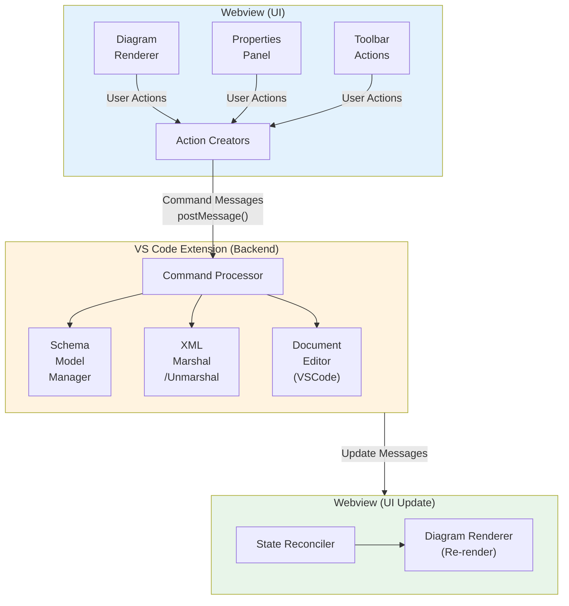
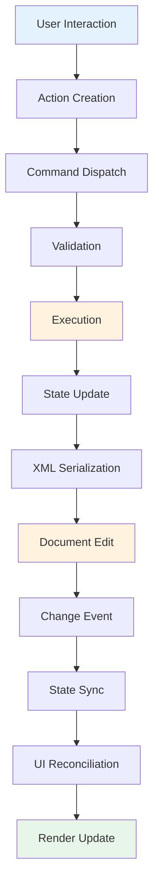

# ADR 001: Editor Transition Architecture

**Status:** Proposed  
**Date:** 2025-12-01  
**Authors:** Project Team  
**Type:** Architecture Decision Record

## 1. Overview (Goal)

### Current State

The Visual XML Schema Editor currently operates as a **viewer** with limited editing capabilities. The architecture follows a one-way data flow pattern where:

- The VS Code extension parses XSD files and sends schema objects to the webview
- The webview renders the schema diagram but has minimal interaction capabilities
- Document changes trigger re-parsing and full diagram updates
- The `applySchemaChanges` method is stubbed but not implemented

### Goal

Transform the viewer into a fully-functional **visual editor** that allows users to:

- Modify XML schema elements, attributes, and types directly through the diagram
- Add, remove, and edit schema components visually
- See changes reflected immediately in both the diagram and the underlying XSD file
- Maintain consistency between the visual representation and the XML document
- Support undo/redo operations through VS Code's native editing infrastructure

### Success Criteria

- Users can perform common schema editing operations (add/remove/modify elements) through the diagram
- Changes are persisted back to the XSD file correctly
- The editing experience is responsive and intuitive
- Integration with VS Code features (undo/redo, dirty state, save) works seamlessly
- The architecture supports incremental feature additions

## 2. Architectural Pattern (Command-Driven State Updates)

### Pattern Choice: Command Pattern with Event Sourcing Principles

The editor will use a **Command Pattern** architecture to manage state updates, providing:

- **Encapsulation**: Each editing operation is encapsulated as a command object
- **Reversibility**: Commands can be undone/redone by design
- **Auditability**: Command history provides a log of all editing operations
- **Consistency**: Centralized command execution ensures state coherence

### Key Components



### Why This Pattern?

1. **Separation of Concerns**: Clear boundaries between UI actions, business logic, and data persistence
2. **Testability**: Commands can be tested in isolation
3. **Extensibility**: New editing operations can be added as new command types
4. **Integration**: Works naturally with VS Code's document editing model
5. **State Management**: Single source of truth maintained in the extension with derived state in webview

## 3. Data Flow (Action → Command → Extension Processing → Update Cycle → Reconciliation)

### Detailed Flow



### Step-by-Step Process

#### 3.1 User Interaction & Action Creation (Webview)

```typescript
// User clicks "Add Element" button
button.addEventListener("click", () => {
  const command = {
    type: "addElement",
    payload: {
      parentId: selectedNode.id,
      elementName: "newElement",
      elementType: "string",
    },
  };
  vscode.postMessage({
    command: "executeCommand",
    data: command,
  });
});
```

#### 3.2 Command Dispatch & Validation (Extension)

```typescript
// Extension receives command
handleWebviewMessage(message) {
  const command = message.data;

  // Validate command
  if (!this.validator.isValid(command)) {
    this.sendError('Invalid command');
    return;
  }

  // Execute command
  this.commandProcessor.execute(command, this.schemaModel);
}
```

#### 3.3 Execution & State Update (Extension)

```typescript
// Command processor updates schema model
execute(command, schemaModel) {
  switch(command.type) {
    case 'addElement':
      const parent = schemaModel.findNode(command.payload.parentId);
      const newElement = schemaModel.createElement(command.payload);
      parent.addChild(newElement);
      break;
    // ... other commands
  }
}
```

#### 3.4 XML Serialization & Document Edit (Extension)

```typescript
// Marshal updated schema to XML
const xmlContent = marshal(schemaModel);

// Apply edit to VS Code document
const edit = new vscode.WorkspaceEdit();
edit.replace(
  document.uri,
  new vscode.Range(0, 0, document.lineCount, 0),
  xmlContent
);
await vscode.workspace.applyEdit(edit);
```

#### 3.5 Change Event & State Sync (Extension)

```typescript
// VS Code triggers document change event
vscode.workspace.onDidChangeTextDocument((e) => {
  if (e.document.uri === currentDocument.uri) {
    // Re-parse and send to webview
    const updatedSchema = unmarshal(schema, e.document.getText());
    webview.postMessage({
      command: "updateSchema",
      data: updatedSchema,
    });
  }
});
```

#### 3.6 UI Reconciliation & Render Update (Webview)

```typescript
// Webview receives updated schema
window.addEventListener("message", (event) => {
  if (event.data.command === "updateSchema") {
    // Smart reconciliation - only update what changed
    this.reconciler.updateDiagram(this.currentSchema, event.data.data);
    this.currentSchema = event.data.data;
  }
});
```

### Flow Characteristics

- **Unidirectional**: Data flows in one clear direction
- **Predictable**: Each step has well-defined inputs and outputs
- **Observable**: Each stage can be logged and monitored
- **Interruptible**: Validation can halt invalid operations early
- **Transactional**: Changes are atomic at the document level

## 4. Proposed Changes

### 4.1 Shared Types (shared/types.ts)

#### Command Definitions

```typescript
// Base command interface
export interface Command {
  type: string;
  payload: any;
  timestamp?: number;
  userId?: string; // For future multi-user support
}

// Specific command types
export interface AddElementCommand extends Command {
  type: "addElement";
  payload: {
    parentId: string;
    elementName: string;
    elementType: string;
    minOccurs?: number;
    maxOccurs?: number | "unbounded";
  };
}

export interface RemoveElementCommand extends Command {
  type: "removeElement";
  payload: {
    elementId: string;
  };
}

export interface ModifyElementCommand extends Command {
  type: "modifyElement";
  payload: {
    elementId: string;
    properties: {
      name?: string;
      type?: string;
      minOccurs?: number;
      maxOccurs?: number | "unbounded";
    };
  };
}

export interface AddAttributeCommand extends Command {
  type: "addAttribute";
  payload: {
    elementId: string;
    attributeName: string;
    attributeType: string;
    use?: "optional" | "required" | "prohibited";
  };
}

export interface ModifyAttributeCommand extends Command {
  type: "modifyAttribute";
  payload: {
    elementId: string;
    attributeId: string;
    properties: {
      name?: string;
      type?: string;
      use?: "optional" | "required" | "prohibited";
    };
  };
}

// Union type for type safety
export type SchemaCommand =
  | AddElementCommand
  | RemoveElementCommand
  | ModifyElementCommand
  | AddAttributeCommand
  | ModifyAttributeCommand;
```

#### Message Protocol

```typescript
// Extension → Webview messages
export interface CommandExecutedMessage extends Message {
  command: "commandExecuted";
  data: {
    success: boolean;
    commandType: string;
    error?: string;
  };
}

// Webview → Extension messages
export interface ExecuteCommandMessage extends Message {
  command: "executeCommand";
  data: SchemaCommand;
}
```

### 4.2 Extension Side (src/)

#### Command Processor (src/commandProcessor.ts)

```typescript
export class CommandProcessor {
  execute(command: SchemaCommand, schemaModel: schema): void {
    switch (command.type) {
      case "addElement":
        this.addElement(command.payload, schemaModel);
        break;
      case "removeElement":
        this.removeElement(command.payload, schemaModel);
        break;
      case "modifyElement":
        this.modifyElement(command.payload, schemaModel);
        break;
      // ... other command handlers
    }
  }

  private addElement(
    payload: AddElementCommand["payload"],
    schema: schema
  ): void {
    // Implementation: navigate schema tree, add new element
  }

  private removeElement(
    payload: RemoveElementCommand["payload"],
    schema: schema
  ): void {
    // Implementation: navigate schema tree, remove element
  }

  // ... other command implementations
}
```

#### Schema Model Manager (src/schemaModelManager.ts)

```typescript
export class SchemaModelManager {
  private currentSchema: schema | null = null;

  updateFromDocument(document: vscode.TextDocument): void {
    this.currentSchema = unmarshal(schema, document.getText());
  }

  applyCommand(command: SchemaCommand): void {
    if (!this.currentSchema) return;

    const processor = new CommandProcessor();
    processor.execute(command, this.currentSchema);
  }

  serialize(): string {
    if (!this.currentSchema) return "";
    return marshal(this.currentSchema);
  }

  getSchema(): schema | null {
    return this.currentSchema;
  }
}
```

#### Updated WebviewProvider (src/webviewProvider.ts)

```typescript
export class SchemaEditorProvider implements vscode.CustomTextEditorProvider {
  private schemaManager: SchemaModelManager;
  private commandProcessor: CommandProcessor;

  constructor(private readonly context: vscode.ExtensionContext) {
    this.schemaManager = new SchemaModelManager();
    this.commandProcessor = new CommandProcessor();
  }

  private async handleWebviewMessage(
    message: any,
    document: vscode.TextDocument
  ) {
    switch (message.command) {
      case "executeCommand":
        await this.executeCommand(message.data, document);
        break;
      // ... other message handlers
    }
  }

  private async executeCommand(
    command: SchemaCommand,
    document: vscode.TextDocument
  ): Promise<void> {
    try {
      // Apply command to schema model
      this.schemaManager.applyCommand(command);

      // Serialize to XML
      const xmlContent = this.schemaManager.serialize();

      // Apply edit to document
      const edit = new vscode.WorkspaceEdit();
      edit.replace(
        document.uri,
        new vscode.Range(0, 0, document.lineCount, 0),
        xmlContent
      );

      const success = await vscode.workspace.applyEdit(edit);

      // Send feedback to webview
      this.webview.postMessage({
        command: "commandExecuted",
        data: {
          success,
          commandType: command.type,
        },
      });
    } catch (error) {
      this.webview.postMessage({
        command: "commandExecuted",
        data: {
          success: false,
          commandType: command.type,
          error: (error as Error).message,
        },
      });
    }
  }
}
```

### 4.3 Webview Side (webview-src/)

#### Action Creators (webview-src/actions.ts)

```typescript
export class SchemaActions {
  constructor(private vscode: VSCodeAPI) {}

  addElement(parentId: string, elementName: string, elementType: string): void {
    const command: AddElementCommand = {
      type: "addElement",
      payload: { parentId, elementName, elementType },
    };

    this.vscode.postMessage({
      command: "executeCommand",
      data: command,
    });
  }

  removeElement(elementId: string): void {
    const command: RemoveElementCommand = {
      type: "removeElement",
      payload: { elementId },
    };

    this.vscode.postMessage({
      command: "executeCommand",
      data: command,
    });
  }

  modifyElement(elementId: string, properties: any): void {
    const command: ModifyElementCommand = {
      type: "modifyElement",
      payload: { elementId, properties },
    };

    this.vscode.postMessage({
      command: "executeCommand",
      data: command,
    });
  }
}
```

#### State Reconciler (webview-src/reconciler.ts)

```typescript
export class StateReconciler {
  /**
   * Intelligently update the diagram by comparing old and new schema
   * Only re-render changed portions of the diagram
   */
  updateDiagram(
    oldSchema: schema | null,
    newSchema: schema,
    renderer: DiagramRenderer
  ): void {
    if (!oldSchema) {
      // First render - do full render
      renderer.renderSchema(newSchema);
      return;
    }

    // Find differences
    const diff = this.computeDiff(oldSchema, newSchema);

    if (diff.requiresFullRerender) {
      renderer.renderSchema(newSchema);
    } else {
      // Apply incremental updates
      diff.additions.forEach((node) => renderer.addNode(node));
      diff.removals.forEach((nodeId) => renderer.removeNode(nodeId));
      diff.modifications.forEach((change) => renderer.updateNode(change));
    }
  }

  private computeDiff(oldSchema: schema, newSchema: schema): SchemaDiff {
    // Implementation: compare schema trees and identify changes
    // Return structured diff object
  }
}
```

#### Updated Main App (webview-src/main.ts)

```typescript
class SchemaEditorApp {
  private actions: SchemaActions;
  private reconciler: StateReconciler;

  constructor() {
    this.vscode = acquireVsCodeApi();
    this.actions = new SchemaActions(this.vscode);
    this.reconciler = new StateReconciler();

    // ... existing initialization

    this.setupEditingActions();
  }

  private setupEditingActions(): void {
    // Connect UI elements to actions
    document.getElementById("addElementBtn")?.addEventListener("click", () => {
      const selectedNodeId = this.propertyPanel.getSelectedNodeId();
      if (selectedNodeId) {
        this.actions.addElement(selectedNodeId, "newElement", "string");
      }
    });

    // ... other editing actions
  }

  private setupMessageListener(): void {
    window.addEventListener("message", (event) => {
      const message = event.data;
      switch (message.command) {
        case "updateSchema":
          this.reconciler.updateDiagram(
            this.currentSchema,
            message.data,
            this.renderer
          );
          this.currentSchema = message.data;
          this.saveState();
          break;

        case "commandExecuted":
          this.handleCommandFeedback(message.data);
          break;

        // ... other message handlers
      }
    });
  }

  private handleCommandFeedback(feedback: any): void {
    if (feedback.success) {
      // Show success indicator
      this.showNotification(`${feedback.commandType} executed successfully`);
    } else {
      // Show error
      this.showError(
        `Failed to execute ${feedback.commandType}: ${feedback.error}`
      );
    }
  }
}
```

## 5. Diagram Integration Strategy

### Current Diagram Renderer

The existing diagram renderer (ported from xsddiagram) handles:

- Parsing schema structure into diagram items
- Layout calculation (positioning elements)
- SVG rendering
- Expand/collapse functionality

### Integration Approach

#### 5.1 Make Diagram Interactive

```typescript
// Add editing capabilities to diagram items
class DiagramItem {
  // Existing properties...

  // New: Enable editing interactions
  enableEditing(): void {
    this.addContextMenu();
    this.addInlineEditing();
    this.addDragAndDrop();
  }

  private addContextMenu(): void {
    // Right-click menu for: Add Child, Delete, Edit Properties
  }

  private addInlineEditing(): void {
    // Double-click to edit element name
  }

  private addDragAndDrop(): void {
    // Drag to reorder or move elements
  }
}
```

#### 5.2 Visual Feedback for Editing

```typescript
// Provide visual feedback during editing
class DiagramRenderer {
  highlightEditableNode(nodeId: string): void {
    // Add highlight border to indicate editable state
  }

  showTemporaryNode(nodeConfig: any): void {
    // Preview of new node before creation
  }

  animateNodeChange(
    nodeId: string,
    changeType: "add" | "remove" | "modify"
  ): void {
    // Smooth transitions for changes
  }
}
```

#### 5.3 Toolbar Enhancement

```html
<!-- Add editing tools to toolbar -->
<div id="toolbar">
  <!-- Existing tools -->
  <button id="zoomIn">Zoom In</button>
  <button id="zoomOut">Zoom Out</button>
  <button id="fitView">Fit View</button>

  <!-- New editing tools -->
  <div class="toolbar-separator"></div>
  <button id="addElement" title="Add Element">➕ Element</button>
  <button id="addAttribute" title="Add Attribute">🏷️ Attribute</button>
  <button id="deleteSelected" title="Delete">🗑️ Delete</button>

  <!-- Selection info -->
  <div id="selection-info">
    <span id="selected-node-name"></span>
  </div>
</div>
```

#### 5.4 Properties Panel Enhancement

```typescript
class PropertyPanel {
  display(item: DiagramItem): void {
    // Current: Read-only display
    // New: Editable form fields

    this.renderEditableProperties(item, {
      name: { type: "text", validator: validateXMLName },
      type: { type: "select", options: this.getAvailableTypes() },
      minOccurs: { type: "number", min: 0 },
      maxOccurs: { type: "number", min: 1, allowUnbounded: true },
    });
  }

  private renderEditableProperties(item: DiagramItem, fields: any): void {
    // Create form with editable fields
    // On change, emit command through actions
  }
}
```

### 5.5 Selection Model

```typescript
// Manage selected nodes for editing operations
class SelectionManager {
  private selectedNodeIds: Set<string> = new Set();

  select(nodeId: string, multi: boolean = false): void {
    if (!multi) {
      this.selectedNodeIds.clear();
    }
    this.selectedNodeIds.add(nodeId);
    this.emit("selectionChanged", Array.from(this.selectedNodeIds));
  }

  getSelection(): string[] {
    return Array.from(this.selectedNodeIds);
  }

  clearSelection(): void {
    this.selectedNodeIds.clear();
    this.emit("selectionChanged", []);
  }
}
```

## 6. Implementation Roadmap

### Phase 1: Foundation (Weeks 1-2)

**Goal**: Establish command infrastructure

#### Milestones:

- [ ] Define command types in shared/types.ts
- [ ] Implement CommandProcessor class
- [ ] Implement SchemaModelManager class
- [ ] Update message protocol
- [ ] Add command validation
- [ ] Write unit tests for command execution

**Success Criteria**: Commands can be defined, validated, and executed in isolation

### Phase 2: Basic Editing (Weeks 3-4)

**Goal**: Implement core editing operations

#### Milestones:

- [ ] Implement AddElementCommand handler
- [ ] Implement RemoveElementCommand handler
- [ ] Implement ModifyElementCommand handler
- [ ] Connect commands to document edits
- [ ] Implement basic error handling
- [ ] Test with simple schema modifications

**Success Criteria**: Can add, remove, and modify elements programmatically

### Phase 3: UI Integration (Weeks 5-6)

**Goal**: Make diagram interactive

#### Milestones:

- [ ] Implement SchemaActions in webview
- [ ] Add context menu to diagram items
- [ ] Implement toolbar editing buttons
- [ ] Make properties panel editable
- [ ] Add visual feedback for operations
- [ ] Implement selection manager

**Success Criteria**: Users can perform editing operations through the UI

### Phase 4: State Reconciliation (Weeks 7-8)

**Goal**: Optimize diagram updates

#### Milestones:

- [ ] Implement StateReconciler
- [ ] Add diff computation algorithm
- [ ] Implement incremental diagram updates
- [ ] Add animation/transitions for changes
- [ ] Test with complex schemas
- [ ] Performance optimization

**Success Criteria**: Diagram updates are smooth and only re-render what changed

### Phase 5: Advanced Features (Weeks 9-10)

**Goal**: Add sophisticated editing capabilities

#### Milestones:

- [ ] Implement attribute editing commands
- [ ] Add drag-and-drop reordering
- [ ] Implement copy/paste functionality
- [ ] Add keyboard shortcuts
- [ ] Implement inline editing (double-click)
- [ ] Add validation feedback in UI

**Success Criteria**: Editor supports full range of schema modifications

### Phase 6: Polish & Testing (Weeks 11-12)

**Goal**: Production readiness

#### Milestones:

- [ ] Comprehensive integration testing
- [ ] Error handling and recovery
- [ ] Performance testing with large schemas
- [ ] Accessibility improvements
- [ ] Documentation and user guide
- [ ] Bug fixes and refinements

**Success Criteria**: Editor is stable, performant, and ready for users

### Testing Strategy

#### Unit Tests

- Command execution logic
- Schema model updates
- XML marshaling/unmarshaling
- Diff computation

#### Integration Tests

- End-to-end command flow
- Document synchronization
- Webview message handling
- Error scenarios

#### Manual Testing

- User workflows (add/edit/delete)
- Complex schema modifications
- Performance with large schemas
- Edge cases and error conditions

### Risk Mitigation

#### Risk 1: XML Marshaling Complexity

**Mitigation**:

- Use existing xmlbind-ts library
- Extensive testing of round-trip conversions
- Fallback to text-based edits if marshaling fails

#### Risk 2: Performance with Large Schemas

**Mitigation**:

- Implement incremental updates (StateReconciler)
- Lazy rendering of collapsed nodes
- Virtual scrolling for large diagrams
- Performance profiling and optimization

#### Risk 3: Undo/Redo Integration

**Mitigation**:

- Rely on VS Code's native undo/redo for documents
- Ensure all edits go through WorkspaceEdit API
- Test undo/redo extensively

#### Risk 4: State Synchronization

**Mitigation**:

- Single source of truth in extension
- Webview only holds derived state
- Reconciliation handles conflicts
- Comprehensive state testing

## 7. Future Enhancements

### Multi-User Collaboration

- Command log for conflict resolution
- Operational transformation for concurrent edits
- Live presence indicators

### Advanced Validation

- Real-time schema validation
- Type checking
- Cross-reference validation
- Custom validation rules

### Import/Export

- Import from other formats (DTD, JSON Schema)
- Export to other formats
- Schema templates and snippets

### Visualization Options

- Multiple diagram layouts (tree, graph, compact)
- Customizable themes
- Print and export diagram as image
- Minimap for large schemas

## 8. Conclusion

This architecture provides a solid foundation for transitioning the Visual XML Schema Editor from a viewer to a full-featured editor. The command-driven pattern ensures:

- **Maintainability**: Clear separation of concerns
- **Extensibility**: Easy to add new editing operations
- **Reliability**: Centralized validation and error handling
- **Performance**: Incremental updates minimize re-rendering
- **User Experience**: Responsive editing with immediate feedback

The phased implementation approach allows for iterative development and testing, reducing risk while delivering value incrementally.

## References

- [VS Code Custom Editor API](https://code.visualstudio.com/api/extension-guides/custom-editors)
- [Command Pattern](https://refactoring.guru/design-patterns/command)
- [xmlbind-ts Library](https://github.com/neumaennl/xmlbind-ts)
- [XSD Diagram Viewer](https://github.com/dgis/xsddiagram)
