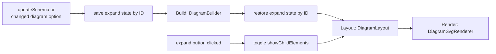

# Purpose

The diagram is the main view of the editor: a tree of nodes that shows the structure of the schema and is the target of clicks and drops. This document describes how the schema object that the webview receives becomes that SVG tree, how it is laid out and drawn, and what it does and does not show. Where the diagram sits in the webview, the settings that change it, zoom and pan are described in [Editor](editor.md#diagram); dropping constructs on nodes in [Drag and drop](drag-and-drop.md).

# Pipeline

The diagram is produced in three steps. `DiagramRenderer` in `webview-src/renderer.ts` runs them; the steps live in `webview-src/diagram/`:[^renderer]

1. **Build.** `DiagramBuilder` turns the schema object into a `Diagram` with a tree of `DiagramItem`s.[^diagram-builder]
2. **Layout.** `DiagramLayout` computes the size and position of every visible item.[^diagram-layout]
3. **Render.** `DiagramSvgRenderer` draws the items as SVG.[^svg-renderer]

A new schema or a changed diagram option calls `renderSchema()`, which runs all three steps. Before the build, it saves `showChildElements` of every item by ID; after the build, it sets it again on the items with the same ID. Since the IDs are paths (see [Schema model](schema-model.md#node-ids)), nodes stay expanded after an edit, unless the edit changes their path, for example by a rename. New items start collapsed, so a newly opened schema shows only the root node. Expanding or collapsing a node calls `refresh()`, which only lays out and renders the existing diagram again.[^renderer]

There is no incremental update: every step works on the whole diagram. `DiagramLayout.relayoutItem()` was meant for partial updates but is not called (see [Known issues](known-issues.md#diagram-is-rebuilt-in-full-on-every-change)).

If a step throws, the renderer writes "Error: …" as SVG text into the canvas and throws again; the app catches the error and shows it in the notification bar as well.[^webview-main] The SVG text stays after the next successful render (see [Known issues](known-issues.md#diagram-error-text-stays-after-a-successful-render)).

# From schema to diagram items

The root of the tree is always one item for the schema itself, labelled `Schema: <targetNamespace>` (or `Schema: no namespace`). It carries the schema's documentation, and the top-level attributes are stored as its attributes. Its children are the top-level constructs, in this order: elements, complex types, simple types, named groups. Within each kind, the document order is kept. A schema without any of them gets the child "No elements found".[^diagram-builder]

| Schema construct | Item type | Label | Type text (shown with `showType`) |
|---|---|---|---|
| Schema | `element` | `Schema: <namespace>` | |
| Element (top-level or local) | `element` | name, or "unnamed" without a name | value of `type`, or `<anonymous complexType>` / `<anonymous simpleType>` for an inline type |
| Named complex type | `type` | name | `complexType` |
| Named simple type | `type` | name | `simpleType` |
| Named group | `group` | name | |
| `sequence`, `choice`, `all` | `group` (compositor) | none, the symbol is drawn instead | |
| Group reference | `group`, marked as reference | value of `ref` | |

The type text gets suffixes for content and derivation, for example `complexType with complexContent (extends Base)`:[^schema-processors][^schema-processors-simple]

- `with complexContent` or `with simpleContent`;
- `(extends X)`, `(restricts X)`;
- `(list of X)` or `(list)`, `(union of A, B)` or `(union)`.

**Inline types.** An anonymous complex or simple type is not a node of its own. Its content is merged into the element: the compositors of the type become children of the element, and its documentation is used if the element has none (see [Known issues](known-issues.md#inline-types-have-no-node-of-their-own)).[^schema-processors]

**Children.** Complex types, elements with an inline complex type and extensions get their compositor (`sequence`, `choice` or `all`) or group reference as a child. A compositor's children are its elements, then its group references, then nested `choice`s, then nested `sequence`s. This order is fixed and not the order of the schema (see [Known issues](known-issues.md#particles-are-not-shown-in-document-order)). A restriction of complex content shows no children (see [Known issues](known-issues.md#restricted-complex-content-is-shown-without-content-and-attributes)).[^schema-processors]

**References are not expanded.** An element with `type="Address"` has no children, even if `Address` is a complex type with content; the content is only shown at the type's own node. Group references are not expanded either. So there are no cycles, even for recursive schemas.

**Not shown as nodes:**

- attributes: they are stored in `item.attributes` and shown in the property panel; attributes with `ref` are skipped;
- attribute groups and attribute group references (see [Known issues](known-issues.md#palette-has-no-entry-for-attribute-groups));
- `any` and `anyAttribute`;
- element references: shown as "unnamed" elements (see [Known issues](known-issues.md#element-references-are-not-shown-as-references));
- imports, includes, redefines, notations and identity constraints (`key`, `keyref`, `unique`); they cannot be edited in the property panel either (see [Known issues](known-issues.md#imports-and-includes-cannot-be-edited-in-the-editor) and [Known issues](known-issues.md#identity-constraints-notations-and-redefines-cannot-be-shown-or-edited)).

**Values.** Besides the label, the builder copies the values the property panel needs into the item: occurrence (`minOccurrence`, `maxOccurrence` with -1 for `unbounded`), documentation (all entries joined with line breaks, plus the individual entries with their IDs), `abstract`, `mixed`, `nillable`, default and fixed values, the derivation kind, list item type, union member types and the facets of restrictions. Only the occurrence, the documentation and simple content change the drawing.[^builder-helpers][^type-node-creators]

# Data model

`DiagramItem` holds one node:[^diagram-item]

| Group | Fields |
|---|---|
| Identity | `id` (path-based ID), `name`, `type` (type text), `itemType` (`element`, `group`, `type`), `groupType` (`sequence`, `choice`, `all`) |
| Tree | `parent`, `childElements`, `hasChildElements`, `showChildElements` (expanded) |
| Notation | `minOccurrence`, `maxOccurrence`, `isReference`, `isSimpleContent` |
| Layout | `location`, `size`, `elementBox` (the shape), `childExpandButtonBox`, `documentationBox`, `boundingBox` (shape plus visible children) |
| Content for the property panel | `documentation`, `documentationAnnotations`, `attributes`, `restrictions`, `isAbstract`, `isMixed`, `isNillable`, `hasAnonymousComplexType`, `elementDefault`, `elementFixed`, `complexDerivationKind`, `simpleTypeDerivationKind`, `simpleTypeListItemType`, `simpleTypeUnionMemberTypes`, `namespace` |

`Diagram` holds the root items (always one, the schema), the three display options `showDocumentation`, `alwaysShowOccurrence` and `showType`, the style, the bounding box with a padding of 20, and the namespace information of the schema that the property panel uses (`currentSchemaPrefix`, `schemaTargetNamespace`, `schemaNamespacePrefixes`, `localSchemaTypeNames`).[^diagram]

The style is read once from VS Code's CSS variables when the module is loaded: font family, foreground, background and line colors. The colors are written into the SVG as inline styles, so the diagram does not follow a theme change until the webview is recreated (see [Known issues](known-issues.md#diagram-does-not-follow-theme-changes)). The font sizes are fixed: 10 pt for labels, 8 pt for occurrence, 9 pt for documentation.[^diagram-types]

The content fields are copies of values from the schema object; the item does not reference the schema object itself. Replacing the copies with a reference is planned (see [Known issues](known-issues.md#diagram-items-copy-values-from-the-schema-objects), [#360](https://github.com/neumaennl/vscode-visual-xml-schema-editor/issues/360)).

Some fields come from the original and are not used; they are listed in [Known issues](known-issues.md#duplicated-and-dead-code).

# Layout

The layout is a simple tree layout from left to right. Sizes are fixed and do not depend on the text:[^diagram-layout]

| Item | Size |
|---|---|
| Element, type, named group, group reference | 120 × 40 |
| Compositor (`sequence`, `choice`, `all`) | 40 × 20 |

Rules:

- The expand button (12 × 12) sits 5 px to the right of the shape, centered vertically.
- The children of an expanded item start at the shape's right edge + 22 (button and gaps) + a spacing of 40 for one child or 80 for several children (room for the vertical connector).
- The first child is centered on the parent's middle; each further child is placed below the previous one, at the previous child's bounding box height + 20. So a parent is aligned with its first child, not with the middle of all children.
- An item's bounding box covers its shape and the bounding boxes of its visible children. It does not include the documentation, the expand button or the occurrence text.
- Root items are stacked from y = 0, with 20 px between them.
- With `showDocumentation`, an item with documentation gets a documentation box 5 px below its shape, 200 px wide. Its height is estimated as 12 px per 30 characters + 10, at most 100. The box is not part of the bounding box, so the documentation overlaps the next item (see [Known issues](known-issues.md#documentation-overlaps-the-next-item)), and the estimate does not match the drawn text (see [Known issues](known-issues.md#documentation-box-size-does-not-match-the-drawn-text)).

# Shapes and notation

| Shape | Meaning |
|---|---|
| Rectangle | Element, also the schema root |
| Octagon | Group; a compositor shows a symbol: for `sequence` three dots on a horizontal line, for `choice` and `all` three dots in a column between connecting lines that differ for the two |
| Rectangle with beveled left corners | Named type; the beveled area is filled for simple types and simple content |
| Dashed outline (`5,3`) | `minOccurs="0"` |
| Second outline offset by 3 px behind the shape | `maxOccurs` other than 1 (also for `maxOccurs="0"`, see [Known issues](known-issues.md#items-with-maxoccurs-0-are-drawn-as-repeated)) |
| `min..max` right of the shape, `∞` for `unbounded` | Occurrence; hidden for `1..1` unless `alwaysShowOccurrence` is set |
| Small arrow at the lower left | Reference (only group references) |
| Box with − or + right of the shape | Expanded or collapsed; only for items with children |

[^shape-renderers][^svg-renderer][^text-renderers]

**Text.** The label is the name, followed by `: <type text>` when `showType` is set. It is bold and centered. If it does not fit into the shape minus 10 px, it is cut with "…" (binary search with `getBBox()`), and the full text becomes the tooltip. Compositors have no label; their name (`sequence`, `choice`, `all`) is the tooltip of the item.[^text-renderers]

**Documentation.** With `showDocumentation`, the first three lines of the documentation are drawn in the documentation box, each cut after 50 characters. Lines are not wrapped, and cut text is not marked (see [Known issues](known-issues.md#documentation-in-the-diagram-is-cut-off-and-hard-to-read)).[^text-renderers]

**Connectors.** For one child, the line goes from behind the expand button to the middle, down or up to the child's middle, and right to the child. For several children, a vertical line midway between the button and the children connects horizontal lines to each child.[^svg-renderer]

**SVG structure.** The renderer adds a content group to the canvas group that zoom and pan transform (see [Editor](editor.md#navigation)). Each render empties the content group and adds one flat `<g class="diagram-item" data-item-id="…">` per visible item; groups are not nested. The children of an item are added before the item, so the parent is drawn on top. An item's group contains, in this order: a `<title>` (groups only), the connectors to its children, the shape, the label, the documentation, the occurrence, the expand button (`<g class="expand-button">`) and the reference arrow. Colors are inline styles; `styles.css` adds the hover, `.selected` and `.drag-over` highlights.[^svg-renderer][^styles]

# Interaction

All mouse handling on nodes is done with one listener per event type on the canvas. The listener finds the item with `closest("[data-item-id]")` and looks it up by ID in the current diagram.[^renderer]

- **Expand button.** A click inside `.expand-button` toggles `showChildElements` and calls `refresh()`.
- **Selection.** A click elsewhere on an item selects it: `selectNode()` moves the `.selected` class to it, and the property panel shows it. After an `updateSchema`, the app selects the node with the same ID again. After expanding, collapsing or a changed diagram option it does not, so the highlight disappears while the property panel still shows the node (see [Known issues](known-issues.md#selection-highlight-is-lost-after-expanding-or-collapsing)).[^webview-main]
- **Drop targets.** During a palette drag, `dragover` adds `.drag-over` to valid targets, and `drop` hands the item to the drop handler (see [Drag and drop](drag-and-drop.md#flow)).
- **Zoom and pan** change the transform of the canvas group (`updateView()`); `fitToCanvas()` scales and moves it so that the whole diagram fits with 24 px padding. The mouse and toolbar handling is described in [Editor](editor.md#navigation).

`showMessage()` replaces the canvas content with a text, for example "No schema to display". It also replaces the canvas group, so a later render draws into a group that is no longer shown (see [Known issues](known-issues.md#diagram-stays-empty-after-showmessage)).

# Origin

The diagram code is a TypeScript port of parts of [XSD Diagram](https://github.com/dgis/xsddiagram) by Régis Cosnier, a C# desktop program that draws XSD files.[^xsddiagram] The port was written by GitHub Copilot. Seven files carry a "Ported from XSD Diagram" comment: `DiagramTypes.ts`, `index.ts`, `DiagramItem.ts`, `Diagram.ts`, `DiagramBuilder.ts`, `DiagramLayout.ts` and `DiagramSvgRenderer.ts`. The main correspondences are:

| XSD Diagram (C#) | Port |
|---|---|
| `XSDDiagrams/Rendering/DiagramItem.cs` | `DiagramItem.ts` |
| `XSDDiagrams/Rendering/Diagram.cs` | `Diagram.ts` |
| `XSDDiagrams/Rendering/DiagramSvgRenderer.cs` | `DiagramSvgRenderer.ts` (with `ShapeRenderers.ts`, `TextRenderers.ts`, `SvgHelpers.ts`) |

The port draws SVG into the DOM instead of using GDI+, reads the classes generated by xmlbind-ts instead of .NET's schema API, and adds IDs, the expand state, selection and drop targets. The layout is simpler than the original's.

Licensing facts: XSD Diagram is offered under GPL, LGPL or MS-PL. This repository is licensed under AGPL-3.0 (`LICENSE`). The ported files carry no license headers. The diagram README that this document replaces stated that the port is under "GPL-2.0, LGPL-3.0, and MS-PL (matching original project)".

# Tests

`DiagramBuilder.test.ts`, `SchemaProcessors.test.ts`, `TypeNodeCreators.test.ts` and `DiagramBuilderHelpers.test.ts` cover the build; `DiagramLayout.test.ts`, `DiagramItem.test.ts` and `Diagram.test.ts` the layout; `DiagramSvgRenderer.test.ts`, `ShapeRenderers.test.ts`, `TextRenderers.test.ts` and `SvgHelpers.test.ts` the drawing; `renderer.test.ts` the expand state, clicks and drag events. The webview tests run in jsdom, which has no layout engine, so `getBBox()` is mocked (`setupGetBBoxMock()` in `webview-src/__tests__/svgTestUtils.ts`).

[^renderer]: DiagramRenderer

[^webview-main]: Webview entry point (SchemaEditorApp)

[^diagram-builder]: DiagramBuilder

[^schema-processors]: Processing of complex types, compositors, group references and extensions

[^schema-processors-simple]: Processing of restrictions, lists and unions

[^type-node-creators]: Nodes for top-level elements and types

[^builder-helpers]: Documentation, occurrence and attribute extraction

[^diagram-item]: DiagramItem

[^diagram]: Diagram

[^diagram-types]: Item types and style

[^diagram-layout]: DiagramLayout

[^svg-renderer]: DiagramSvgRenderer

[^shape-renderers]: Shapes and compositor symbols

[^text-renderers]: Labels, documentation and occurrence text

[^styles]: Webview styles

[^xsddiagram]: XSD Diagram (original C# project)
