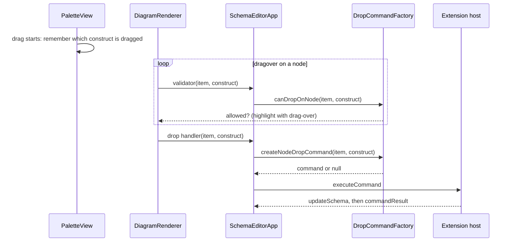

# Purpose

Drag and drop from the palette is the only way to add constructs to a schema (see [UX concept](ux-concept.md#core-rules)). This document describes how a drop becomes a command: who is responsible for what, the order of events, the rules for which construct can be dropped on which node, and the values that new constructs get. The palette itself is described in [Editor](editor.md#palette), the commands in [Commands](commands.md).

# Responsibilities

Drag and drop is split into four parts, so that new constructs and rules can be added without touching the event handling:

| Part | Responsibility |
|---|---|
| Palette (`PaletteView`, `PaletteItems`) | What is dragged: starts the drag and passes the construct. |
| Renderer (`DiagramRenderer`) | Where it is dropped: finds the node under the pointer, shows the highlight and reports the drop. |
| `DropCommandFactory` | Whether the drop is allowed and which command it creates. All placement rules live here. |
| Extension host | Validates and executes the command and sends the updated schema back (see [Persistence](persistence.md)). |

`SchemaEditorApp` in `main.ts` only connects the parts: it gives the renderer a validator and a drop handler that both ask the factory, and sends the resulting command.[^webview-main] The renderer and the app do not know any placement rule.

# Flow

1. **Drag start.** When the user starts dragging a palette item, `PaletteView` remembers which construct (for example `element`) is being dragged. It stores the construct ID in two places:
   - in the browser's drag data (`event.dataTransfer`, under the type `application/x-xsd-component`), which the drop target can read when the item is dropped;
   - in a shared variable in `PaletteItems.ts` (`setActiveDraggedPaletteSchemaConstruct()`), which the renderer can read at any time during the drag.

   The second place is needed because the browser hides the drag data until the drop, so the renderer could not decide which nodes to highlight while the item is moved. `PaletteView` also sets `effectAllowed` to `copy`. Disabled items (`any`) are not draggable. When the drag ends, the shared variable is cleared.[^palette-view][^palette-items]
2. **Drag over.** The renderer listens on the canvas. It finds the nearest element with `data-item-id`, reads the construct from the drag data or, if that is empty, from the shared variable (see [Known issues](known-issues.md#palette-drag-and-drop-uses-two-ways-to-pass-the-dragged-construct)), and calls the validator. If the drop is allowed, it calls `preventDefault()` and adds the CSS class `drag-over`, which highlights the node's shape; otherwise it removes the class.[^renderer]
3. **Drag leave.** The class is only removed when the pointer really leaves the node: if the element under the pointer or the `relatedTarget` is still inside the node, the event is ignored. Without this check, the highlight flickers when the pointer moves between the shapes and texts of one node.
4. **Drop.** The renderer checks the drop again, removes the highlight, calls the drop handler and clears the shared variable.
5. **Command.** `SchemaEditorApp` asks `DropCommandFactory` for the command and sends it as `{ command: "executeCommand", data: command }`. If the factory returns `null`, it shows the error "Drop of '<construct>' is not supported for '<node name>'".[^webview-main]

The extension host validates every command again. The check in the webview is only for immediate feedback; a drop that passes it can still fail, for example because of a name conflict inside the parent, and the error is then shown like any other command error (see [Messaging](messaging.md)).

# Drop rules

The node kinds in the table are:

- **Schema root:** the node with the ID `/schema`.
- **Compositor:** a `sequence`, `choice` or `all` node.
- **Element:** any element node. "With anonymous complex type" and "with simple content" refer to an element whose type is defined inline.
- **Complex type, simple type:** a named type node. A simple type counts as a restriction if its label contains `restricts`; list and union types do not.
- **Group:** a top-level group definition, not a group reference.

| Construct | Target | Command |
|---|---|---|
| element | schema root, compositor | `addElement` with a generated name and type `xs:string` |
| attribute | schema root, complex type labelled exactly `complexType` | `addAttribute` with a generated name and type `xs:string` |
| | element with anonymous complex type | `addAttribute` on the anonymous complex type |
| group | schema root | `addGroup` with a generated name and content model `sequence` (a definition; references cannot be dropped) |
| simpleType | schema root | `addSimpleType` with a generated name and base type `xs:string` |
| | element | `addSimpleType` without name: an anonymous simple type that replaces the element's type |
| complexType | schema root | `addComplexType` with a generated name and content model `sequence` |
| | element | `addComplexType` without name: an anonymous complex type that replaces the element's type |
| sequence, choice, all | complex type | `modifyComplexType` with the new content model |
| | element with anonymous complex type | `modifyComplexType` on the anonymous complex type |
| | other element | `addComplexType` with the content model: a new anonymous complex type |
| | group | `modifyGroup` with the new content model |
| restriction | schema root | `addSimpleType` with a generated name and base type `xs:string` |
| | element with anonymous complex type | `modifyComplexType` with `derivationKind: "restriction"` |
| | element with simple content | `modifySimpleType` on the anonymous simple type |
| | other element | `addSimpleType` without name, based on the element's type |
| | simple type | `modifySimpleType` |
| | complex type | `modifyComplexType` with `derivationKind: "restriction"` |
| extension | schema root | `addComplexType` with a generated name, content model `sequence`, base type `xs:anyType` and `derivationKind: "extension"` |
| | element with anonymous complex type | `modifyComplexType` with `derivationKind: "extension"` |
| | other element | `addComplexType` without name, derived by extension from the element's type |
| | complex type | `modifyComplexType` with `derivationKind: "extension"` |
| facets (all twelve) | simple type derived by restriction, element with simple content derived by restriction | `modifySimpleType` with the existing facets plus the dropped one |
| any | - | not supported (disabled in the palette) |

Every other combination returns `null`. In particular, nothing can be dropped on attributes or group references, and only elements can be dropped on compositors. A compositor drop on a type that already has one replaces the compositor and moves its particles into the new one (see [Commands](commands.md#complex-types)).[^drop-factory] Attributes cannot be dropped on derived named complex types, and on derived anonymous complex types they end up in the wrong place (see [Known issues](known-issues.md#attributes-on-derived-complex-types-are-rejected-or-misplaced)).

# Defaults

**Names.** New named constructs get the names `Element1`, `Attribute1`, `Group1`, `SimpleType1` and `ComplexType1`; the number is the lowest one that is not in use. The factory keeps the names of all top-level elements, attributes, simple types, complex types, groups and attribute groups, refreshed on every schema update. A name is reserved as soon as a command is created, so two drops before the next update do not get the same name; the checks during `dragover` do not reserve names.[^drop-factory] Names of local elements and attributes are not considered, so a drop on a node that already contains a local `Element1` or `Attribute1` is rejected (see [Known issues](known-issues.md#generated-names-ignore-local-names-in-the-drop-target)).

**Types.** New elements and attributes get the type `xs:string`. New complex types get the content model `sequence`.

**Base types.** For a restriction or extension, the base type is the one shown on the node, read from its label (`restricts …` or `extends …`). Without one, a restriction uses `xs:anyType` for complex types and elements with anonymous complex types, and `xs:string` otherwise; an extension uses `xs:anyType`.[^drop-type-helpers]

**Facets.** A dropped facet gets a default value, which overwrites the facet if it already exists:

| Facet | Default |
|---|---|
| `enumeration` | `["value"]` |
| `pattern` | `.*` |
| `length`, `minLength`, `maxLength`, `totalDigits`, `fractionDigits` | `1` |
| `minInclusive`, `maxInclusive`, `minExclusive`, `maxExclusive` | `0` |
| `whiteSpace` | `preserve` |

The facet drop sends only the first existing pattern, and dropping an enumeration or a pattern replaces the existing values instead of adding one (see [Known issues](known-issues.md#editing-facets-drops-all-but-the-first-pattern) and [Known issues](known-issues.md#dropping-an-enumeration-replaces-the-existing-values)). Facets are not checked against the base type (see [Known issues](known-issues.md#facets-are-not-checked-against-the-base-type)).

# Adding a draggable construct

1. Add the construct to `PaletteSchemaConstruct`.
2. Add a palette item in `PaletteItems.ts` (group, label, Codicon, tooltip), if users should drag it.
3. Add the placement rules and the command to `DropCommandFactory`, or to `DropCommandFactoryTypeHelpers` for types and facets. The validator in the renderer uses the same method, so hover feedback and drop stay consistent.
4. If the command is new, add it as described in [Commands](commands.md#files).
5. Add tests: placement and payloads in `DropCommandFactory.test.ts`, drag events in `renderer.test.ts` only if the event handling changes.[^drop-factory-tests]

The tests that cover drag and drop are `DropCommandFactory.test.ts` (rules, payloads, names, base types, facets), `renderer.test.ts` (validator, highlight, fallback, drag leave guard) and `PaletteView.test.ts` (drag payload and cleanup).

[^palette-items]: Palette item definitions and MIME type

[^palette-view]: PaletteView

[^renderer]: DiagramRenderer (drop handling)

[^webview-main]: Webview entry point (SchemaEditorApp)

[^drop-factory]: DropCommandFactory

[^drop-type-helpers]: Drop helpers for types, derivations and facets

[^drop-factory-tests]: DropCommandFactory tests
