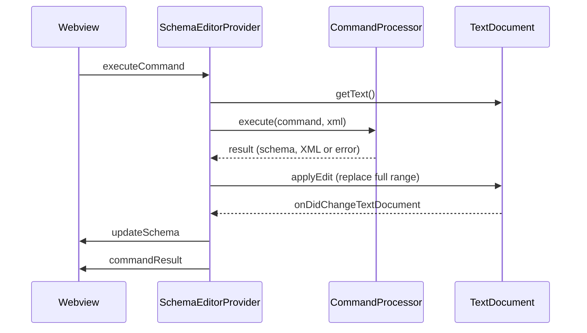

# Purpose

The visual editor has no storage of its own. Every change ends up as an edit of the XSD text document, and the diagram is always rebuilt from that document. This concept describes how a command from the webview becomes a document edit, what serialization does to the file, how undo and saving work, and how changes made outside the visual editor reach the diagram. The parts involved are described in [Architecture](architecture.md), the object model in [Schema model](schema-model.md), and the webview side in [Editor](editor.md).

# The document is the only state

`SchemaEditorProvider` is a `CustomTextEditorProvider`, so the visual editor works on the same `TextDocument` as the text editor, including unsaved changes.[^extension] The extension host keeps no schema between commands: for every command, `CommandProcessor` parses the current document text again.[^command-processor] The webview keeps the last schema it received only to render it; it is never sent back. Commands therefore always work on what is in the document right now, even if it was just changed in the text editor.

# Command pipeline

1. **Receive.** The webview posts `executeCommand` with a `SchemaCommand`. It does not wait for an answer and has no "pending" state.[^webview-main]
2. **Parse.** `CommandProcessor.execute()` loads the document text with `SchemaModelManager.loadFromXml()`.[^command-processor]
3. **Validate.** `CommandValidator` checks the command against the parsed schema.
4. **Execute on a copy.** `SchemaModelManager.cloneSchema()` creates a deep copy (marshal and unmarshal), and `CommandExecutor` changes the copy. A failure leaves the original untouched.[^model-manager]
5. **Serialize and check.** The copy is marshalled to XML, and the XML is parsed again. If it does not parse, the command fails.
6. **Write.** The provider replaces the full range of the document with the new XML in one `WorkspaceEdit` and calls `vscode.workspace.applyEdit()`.[^webview-provider]
7. **Refresh.** The edit fires `onDidChangeTextDocument`, and the provider parses the document and sends `updateSchema`, as for any other change (see [Changes from outside](#changes-from-outside)).

`execute()` is synchronous and returns a result object instead of throwing. The provider maps the outcome to messages:[^webview-provider][^workspace-edit-test]

| Outcome | Cause | Message to the webview |
|---|---|---|
| Success | Edit applied | `commandResult` `{ success: true }`, plus `updateSchema` from the document change |
| Validation failure | The validator rejected the command | `commandResult` `{ success: false, error }` |
| Runtime failure | An exception in parsing, executing or serializing, for example because the document does not parse | `error` with code `COMMAND_EXECUTION_ERROR` and stack trace; the message starts with "Command execution failed:" |
| Edit rejected | `applyEdit()` returned `false` | `error` with code `COMMAND_EXECUTION_ERROR` |

On `commandResult` with `success: false` and on `error`, the webview shows the message in its notification bar; the diagram stays as it is. A successful `commandResult` or the next `updateSchema` hides the notification.[^webview-main]

# Writing the document

The provider always replaces the whole document, from the start to the end of the last line (an empty document counts as one empty line).[^webview-provider] There is no minimal edit and no check of the document version: the range is computed from the document as it was when the command arrived.

Because of this, each command changes the text of the entire file, even if it only adds one element. How much changes depends on serialization (next section), not on the command.

# What serialization changes

`marshal` from `xmlbind-ts` writes the XML.[^xmlbind-ts] Compared to a hand-written file, the first command after opening changes the following (checked by running commands through `CommandProcessor`):

Kept:

- Comments, including comments before the root element, at their position among the child elements.
- The order of child elements.
- The XML declaration, but only if the file had one.
- The `xmlns:*` prefix declarations, so QName values such as `type="xs:string"` or `type="t:myType"` keep working.

Changed:

- Indentation becomes two spaces.
- Attributes are reordered, and single quotes become double quotes.
- Empty elements written as `` become `<a/>`.
- Element names lose their prefix: `xs:element` becomes `element`, and the XML Schema namespace is declared as the default namespace. If the file already had a different default namespace (usually the target namespace), that declaration is dropped, and unprefixed QName values such as `type="myType"` then point to the XML Schema namespace. The schema is broken after the first command (see [Known issues](known-issues.md#default-namespace-is-replaced-on-serialization)).
- Leading and trailing whitespace in text content such as `documentation` is trimmed. This is intended.

# Undo, redo and save

Because every command is a single `WorkspaceEdit` on the text document, VS Code handles undo, redo, the dirty marker and saving; the extension has no code for them.[^workspace-edit-test] Each successful command is one undo step, also when the visual editor has the focus. Undo and redo change the document, which triggers the normal refresh, so the diagram follows. Saving writes the document as it is; the extension does not write files itself.

# Changes from outside

The provider subscribes to `onDidChangeTextDocument` and reacts to every change of its document, regardless of where it comes from: the provider's own edits, typing in the text editor, undo and redo, other extensions, or VS Code reloading the file after it changed on disk.[^webview-provider]

For each change, the provider:

1. Parses the whole document with `unmarshal`. There is no debounce, so typing in the text editor parses the document on every keystroke. Each parse also logs the content length, the first 200 characters and the parsed object to the console.
2. On success, sends `updateSchema` with the complete schema object. The webview re-renders the diagram, hides the notification, restores the selection by its ID and saves its state.[^webview-main]
3. On failure, sends `error` with the parser message. The webview shows the message and keeps the last diagram that could be parsed. While the document does not parse, every command fails with a runtime error, because the pipeline parses the same text.

# Other state

The XSD document is the only thing the extension writes to a file. Two other kinds of state exist, and neither is stored in the document:

- **Settings.** The diagram options (`xmlSchemaVisualEditor.*`, see [Editor](editor.md#diagram)) are VS Code settings. The extension only reads them and never writes them. When they change, the provider sends `updateDiagramOptions`, and the webview re-renders with the new options; this is not a document change.[^webview-provider]
- **Webview state.** The webview saves the last schema, the zoom and pan, and the diagram options with `vscode.setState()` and reads them back when it is created again.[^webview-main] VS Code keeps this state per editor, also across restarts, so the diagram can be shown before the first `updateSchema` arrives. It is only a cache: the next `updateSchema` replaces the schema. Restoring it is incomplete: the saved zoom and pan are not applied, and the expand state is not saved (see [Editor](editor.md#schemaeditorapp) and [Known issues](known-issues.md#view-state-is-not-restored-after-reopening), [#347](https://github.com/neumaennl/vscode-visual-xml-schema-editor/issues/347)).

# Concurrency

`CommandProcessor` has an `isExecuting` flag that rejects a command while another one runs. Because `execute()` is synchronous, a second command can never arrive while the flag is set, so the flag has no effect.[^command-processor] The part that can overlap is asynchronous and not covered: the provider awaits `applyEdit()`, and the webview does not wait for `commandResult` before sending the next command. A second command that arrives during that wait reads the document text before the first edit and computes its range from it (see [Known issues](known-issues.md#commands-can-overlap-while-an-edit-is-applied)).

Commands also carry IDs from the schema the webview last received. If the document changes in the text editor and the command is sent before the new `updateSchema` arrives, the IDs refer to the old structure. Position-based IDs can then point to a different node (see [Schema model](schema-model.md#node-ids)).

# Limitations

- Schemas whose default namespace is not the XML Schema namespace break on the first command ([Known issues](known-issues.md#default-namespace-is-replaced-on-serialization), [xmlbind-ts#251](https://github.com/neumaennl/xmlbind-ts/issues/251)).
- Every command reformats the whole file ([Known issues](known-issues.md#every-command-reformats-the-whole-document), [xmlbind-ts#252](https://github.com/neumaennl/xmlbind-ts/issues/252)).
- Commands can overlap while an edit is applied ([Known issues](known-issues.md#commands-can-overlap-while-an-edit-is-applied)).
- Every document change is parsed in full and logged ([Known issues](known-issues.md#every-document-change-is-parsed-in-full-and-logged)).
- The provider parses with `unmarshal` directly instead of `SchemaModelManager` ([Known issues](known-issues.md#schemaeditorprovider-parses-xml-without-schemamodelmanager)).

[^extension]: [Extension entry point](../src/extension.ts)

[^webview-provider]: [Custom editor provider](../src/webviewProvider.ts)

[^command-processor]: [CommandProcessor](../src/commandProcessor.ts)

[^model-manager]: [SchemaModelManager](../src/schemaModelManager.ts)

[^webview-main]: [Webview app](../webview-src/main.ts)

[^workspace-edit-test]: [Integration tests for the WorkspaceEdit path](../src/__tests__/pipeline.workspaceEdit.test.ts)

[^xmlbind-ts]: [xmlbind-ts](https://github.com/neumaennl/xmlbind-ts)
